# Player Architecture — Behavioral Diagrams

> Loại tài liệu: Mô tả hành vi và cấu trúc động  
> Trạng thái: Target design, chưa phải hiện trạng đã implement  
> Phạm vi: Android, iOS, Web và macOS  
> Stack: <code>just_audio + audio_service + audio_session + flutter_bloc</code>  
> Cập nhật: 2026-07-11

Tài liệu liên quan:

- [Kế hoạch triển khai Player](./player-implementation-plan.md)
- [Player Class Diagram](./player-class-diagram.md)

## 1. Mục đích

Class Diagram trả lời câu hỏi “hệ thống có những lớp nào và chúng liên hệ với nhau ra sao”. Tài liệu này trả lời các câu hỏi động:

- Khi người dùng nhấn Play, message đi qua những object nào?
- Khi lock screen gửi Pause, vì sao UI vẫn đồng bộ?
- Khi engine buffering, state thay đổi theo thứ tự nào?
- Khi người dùng kéo seek bar, lúc nào mới gọi platform?
- Khi có cuộc gọi hoặc rút tai nghe, object nào chịu trách nhiệm?
- Khi hai request load xảy ra gần nhau, request nào thắng?
- Khi Stop, hệ thống dọn queue, notification và mini player theo thứ tự nào?

Ba loại biểu đồ được sử dụng:

| Biểu đồ | Góc nhìn |
|---|---|
| Sequence Diagram | Message/call giữa object theo trục thời gian |
| State Machine Diagram | Vòng đời và chuyển trạng thái |
| Activity Diagram | Luồng bước, decision và nhánh nghiệp vụ |

## 2. Nguyên tắc hành vi cốt lõi

```text
Command:
UI hoặc OS
→ AppAudioHandler
→ AudioPlayer

State:
AudioPlayer streams
→ AppAudioHandler
→ PlayerCubit + audio_service
→ UI + System Media Controls
```

Các invariant:

1. Mọi command cuối cùng đi vào cùng một <code>AudioPlayer</code>.
2. UI không tự xác nhận thành công của command.
3. State chỉ thay đổi chính thức sau event từ engine.
4. Remote command không bắt buộc Cubit/UI đang tồn tại.
5. Route navigation không điều khiển audio lifecycle.
6. Position không được mô phỏng bằng timer trong Cubit.
7. Queue và current item chỉ được thay đổi bởi <code>AppAudioHandler</code>.

## 3. Các participant trong cấu trúc động

| Participant | Vai trò khi runtime |
|---|---|
| User | Người dùng thao tác trong app |
| System Media Controls | Android notification/lock screen, iOS Now Playing, Web Media Session, macOS Control Center |
| Player widgets | MiniPlayer, ExpandedPlayerScreen, PlayerControlDock |
| PlayerCubit | Nhận UI intent, delegate command, phát UI state |
| PlaybackGateway | Contract mà Cubit dùng để giao tiếp với playback |
| AppAudioHandler | Trung tâm xử lý command, mapping state và OS integration |
| AudioPlayer | just_audio engine, nguồn sự thật playback |
| AudioService | Bridge giữa AppAudioHandler và hệ điều hành |
| AudioSession | Audio focus/interruption configuration |
| Navigator | Sở hữu expanded player route |

## 4. Event Vocabulary

### 4.1. UI intents

| Event | Payload | Nguồn |
|---|---|---|
| <code>OpenItem</code> | PlayerItem, autoplay | Content card |
| <code>OpenQueue</code> | items, index, autoplay | Playlist/course |
| <code>Play</code> | Không | Mini/Dock |
| <code>Pause</code> | Không | Mini/Dock |
| <code>TogglePlayback</code> | Không | Mini/Dock |
| <code>SeekTo</code> | Duration | Slider commit |
| <code>SkipBy</code> | Duration offset | ±10 giây |
| <code>Next</code> | Không | Queue control |
| <code>Previous</code> | Không | Queue control |
| <code>SetSpeed</code> | double | Speed selector |
| <code>SetRepeatMode</code> | enum | Repeat control |
| <code>SetShuffle</code> | bool | Shuffle control |
| <code>Retry</code> | Không | Error UI |
| <code>Stop</code> | Không | Stop/close playback |

### 4.2. Engine events

| Event | Payload |
|---|---|
| <code>PlayerStateChanged</code> | playing + processingState |
| <code>PositionChanged</code> | Duration |
| <code>BufferedPositionChanged</code> | Duration |
| <code>DurationChanged</code> | Duration? |
| <code>CurrentIndexChanged</code> | int? |
| <code>SpeedChanged</code> | double |
| <code>LoopModeChanged</code> | LoopMode |
| <code>ShuffleChanged</code> | bool |
| <code>PlaybackError</code> | PlayerException |

### 4.3. System events

| Event | Nguồn |
|---|---|
| Remote Play/Pause | Lock screen, notification, headset |
| Remote Seek | System timeline/scrubber |
| Remote Next/Previous | Media controls |
| Remote Rewind/Fast-forward | Media controls |
| Audio focus loss | Android/iOS audio session |
| Audio focus regained | Android/iOS audio session |
| Becoming noisy | Rút tai nghe hoặc đổi route |
| App background/foreground | Flutter/platform lifecycle |

## 5. Sequence Diagram — Bootstrap ứng dụng

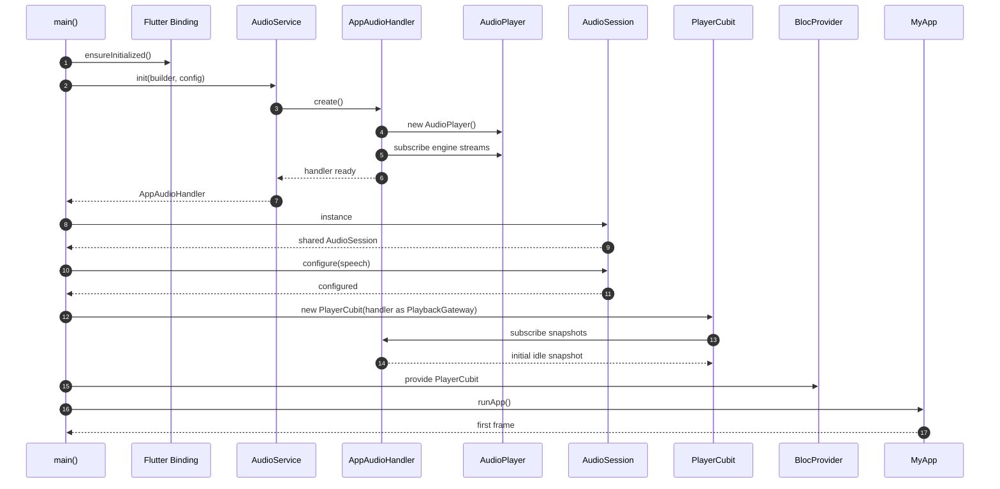
```mermaid
sequenceDiagram
autonumber
participant Main as main()
participant Binding as Flutter Binding
participant AS as AudioService
participant Handler as AppAudioHandler
participant Engine as AudioPlayer
participant Session as AudioSession
participant Cubit as PlayerCubit
participant Provider as BlocProvider
participant App as MyApp

Main->>Binding: ensureInitialized()
Main->>AS: init(builder, config)
AS->>Handler: create()
Handler->>Engine: new AudioPlayer()
Handler->>Engine: subscribe engine streams
Handler-->>AS: handler ready
AS-->>Main: AppAudioHandler

Main->>Session: instance
Session-->>Main: shared AudioSession
Main->>Session: configure(speech)
Session-->>Main: configured

Main->>Cubit: new PlayerCubit(handler as PlaybackGateway)
Cubit->>Handler: subscribe snapshots
Handler-->>Cubit: initial idle snapshot
Main->>Provider: provide PlayerCubit
Main->>App: runApp()
App-->>Main: first frame
```

Behavior contract:

- <code>AudioService.init</code> hoàn tất trước <code>runApp</code>.
- Handler và AudioPlayer chỉ được tạo một lần.
- PlayerCubit nhận handler qua interface <code>PlaybackGateway</code>.
- Initial snapshot là idle, không có current item.
- Mini player và system notification chưa xuất hiện khi idle.

Failure behavior:

- Nếu bootstrap audio service thất bại, app phải log rõ lỗi và khởi động theo fallback được quyết định trước.
- Không được tạo một AudioPlayer thứ hai để “chữa cháy”.

## 6. Sequence Diagram — Load queue và autoplay

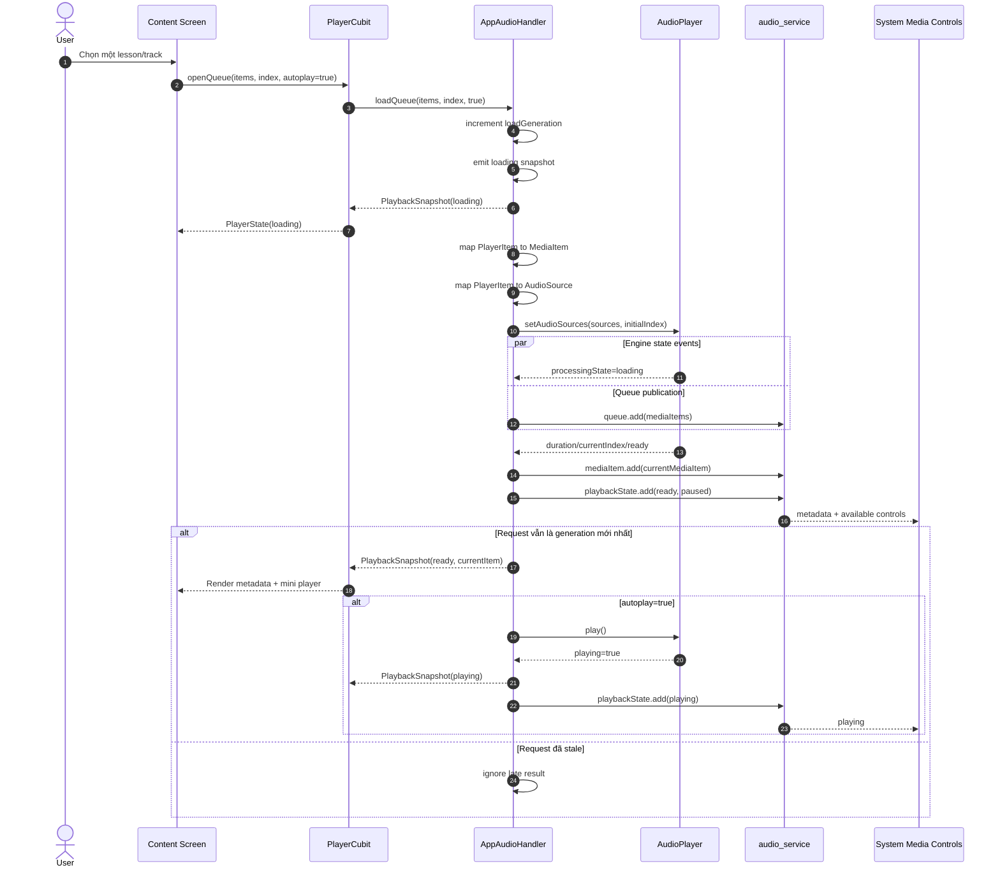
```mermaid
sequenceDiagram
autonumber
actor User
participant UI as Content Screen
participant Cubit as PlayerCubit
participant Handler as AppAudioHandler
participant Engine as AudioPlayer
participant AS as audio_service
participant OS as System Media Controls

User->>UI: Chọn một lesson/track
UI->>Cubit: openQueue(items, index, autoplay=true)
Cubit->>Handler: loadQueue(items, index, true)

Handler->>Handler: increment loadGeneration
Handler->>Handler: emit loading snapshot
Handler-->>Cubit: PlaybackSnapshot(loading)
Cubit-->>UI: PlayerState(loading)

Handler->>Handler: map PlayerItem to MediaItem
Handler->>Handler: map PlayerItem to AudioSource
Handler->>Engine: setAudioSources(sources, initialIndex)

par Engine state events
  Engine-->>Handler: processingState=loading
and Queue publication
  Handler->>AS: queue.add(mediaItems)
end

Engine-->>Handler: duration/currentIndex/ready
Handler->>AS: mediaItem.add(currentMediaItem)
Handler->>AS: playbackState.add(ready, paused)
AS-->>OS: metadata + available controls

alt Request vẫn là generation mới nhất
  Handler-->>Cubit: PlaybackSnapshot(ready, currentItem)
  Cubit-->>UI: Render metadata + mini player
  alt autoplay=true
    Handler->>Engine: play()
    Engine-->>Handler: playing=true
    Handler-->>Cubit: PlaybackSnapshot(playing)
    Handler->>AS: playbackState.add(playing)
    AS-->>OS: playing
  end
else Request đã stale
  Handler->>Handler: ignore late result
end
```

Behavior contract:

- Loading state xuất hiện trước khi engine ready.
- Queue OS và engine được tạo từ cùng một danh sách <code>PlayerItem</code>.
- Current metadata được publish trước hoặc đồng thời với playback bắt đầu.
- Chỉ generation mới nhất được phép trở thành current queue.
- Cubit không tự emit current item trước khi handler xác nhận load.

## 7. Sequence Diagram — Play/Pause từ UI

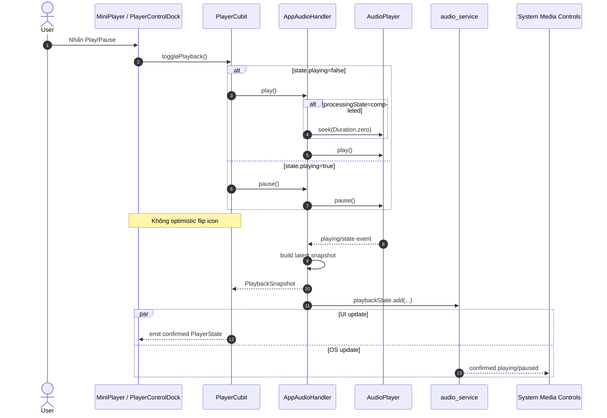
```mermaid
sequenceDiagram
autonumber
actor User
participant UI as MiniPlayer / PlayerControlDock
participant Cubit as PlayerCubit
participant Handler as AppAudioHandler
participant Engine as AudioPlayer
participant AS as audio_service
participant OS as System Media Controls

User->>UI: Nhấn Play/Pause
UI->>Cubit: togglePlayback()

alt state.playing=false
  Cubit->>Handler: play()
  alt processingState=completed
    Handler->>Engine: seek(Duration.zero)
  end
  Handler->>Engine: play()
else state.playing=true
  Cubit->>Handler: pause()
  Handler->>Engine: pause()
end

Note over Cubit,UI: Không optimistic flip icon

Engine-->>Handler: playing/state event
Handler->>Handler: build latest snapshot
Handler-->>Cubit: PlaybackSnapshot
Handler->>AS: playbackState.add(...)

par UI update
  Cubit-->>UI: emit confirmed PlayerState
and OS update
  AS-->>OS: confirmed playing/paused
end
```

Behavior contract:

- UI button chỉ đổi icon khi engine stream xác nhận.
- Nếu engine từ chối play do lỗi/focus, UI không bị kẹt ở trạng thái playing giả.
- Completed + Play thực hiện replay từ đầu.

## 8. Sequence Diagram — Play/Pause từ Lock Screen

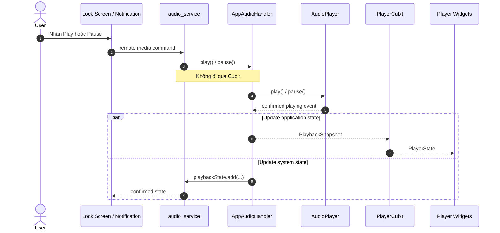
```mermaid
sequenceDiagram
autonumber
actor User
participant OS as Lock Screen / Notification
participant AS as audio_service
participant Handler as AppAudioHandler
participant Engine as AudioPlayer
participant Cubit as PlayerCubit
participant UI as Player Widgets

User->>OS: Nhấn Play hoặc Pause
OS->>AS: remote media command
AS->>Handler: play() / pause()
Note over AS,Handler: Không đi qua Cubit
Handler->>Engine: play() / pause()
Engine-->>Handler: confirmed playing event

par Update application state
  Handler-->>Cubit: PlaybackSnapshot
  Cubit-->>UI: PlayerState
and Update system state
  Handler->>AS: playbackState.add(...)
  AS-->>OS: confirmed state
end
```

Behavior contract:

- Remote command hoạt động khi UI đang background.
- Cubit có thể chưa tồn tại trong một số cold-start/background context; handler vẫn xử lý được.
- Khi UI quay lại, latest snapshot phải khôi phục đúng state.
- Không để OS và UI gọi hai engine instance khác nhau.

## 9. Sequence Diagram — Đồng bộ position liên tục

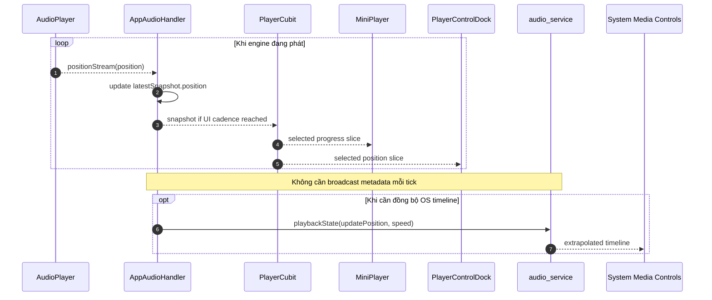
```mermaid
sequenceDiagram
autonumber
participant Engine as AudioPlayer
participant Handler as AppAudioHandler
participant Cubit as PlayerCubit
participant Mini as MiniPlayer
participant Dock as PlayerControlDock
participant AS as audio_service
participant OS as System Media Controls

loop Khi engine đang phát
  Engine-->>Handler: positionStream(position)
  Handler->>Handler: update latestSnapshot.position
  Handler-->>Cubit: snapshot if UI cadence reached
  Cubit-->>Mini: selected progress slice
  Cubit-->>Dock: selected position slice
end

Note over Handler,AS: Không cần broadcast metadata mỗi tick

opt Khi cần đồng bộ OS timeline
  Handler->>AS: playbackState(updatePosition, speed)
  AS-->>OS: extrapolated timeline
end
```

Timing policy:

- UI position cadence mục tiêu: khoảng 200 ms.
- Mini player có thể dùng selector thưa hơn expanded seek bar.
- Metadata chỉ publish khi track/metadata thay đổi.
- System timeline dùng update position + update time + speed để nội suy; không spam platform channel mỗi frame.
- Không rebuild artwork, transcript hoặc toàn screen theo position tick.

## 10. Sequence Diagram — Seek từ slider

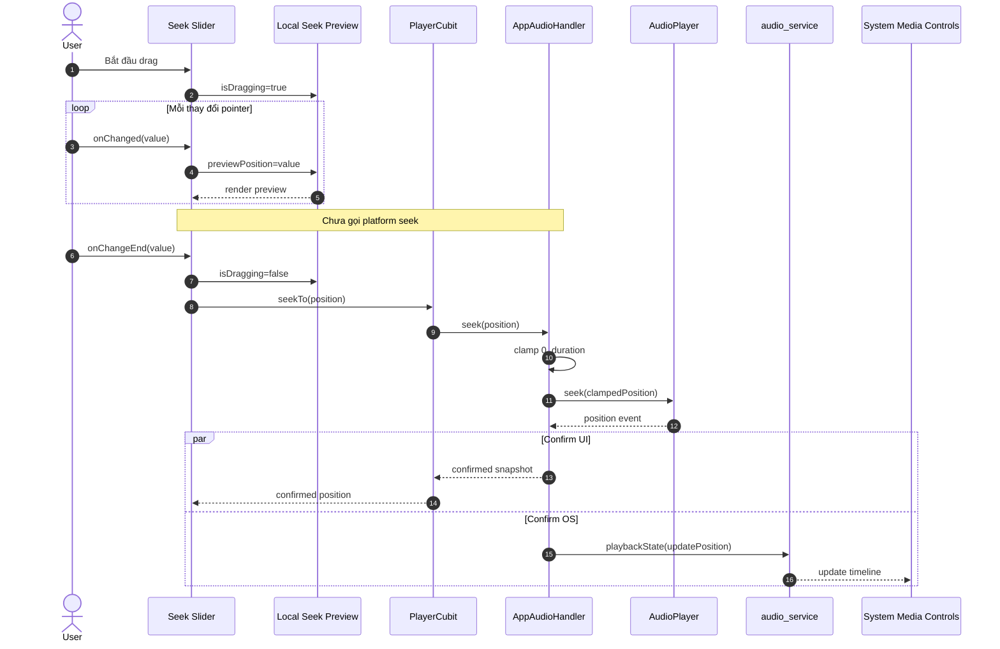
```mermaid
sequenceDiagram
autonumber
actor User
participant Slider as Seek Slider
participant Local as Local Seek Preview
participant Cubit as PlayerCubit
participant Handler as AppAudioHandler
participant Engine as AudioPlayer
participant AS as audio_service
participant OS as System Media Controls

User->>Slider: Bắt đầu drag
Slider->>Local: isDragging=true

loop Mỗi thay đổi pointer
  User->>Slider: onChanged(value)
  Slider->>Local: previewPosition=value
  Local-->>Slider: render preview
end

Note over Slider,Handler: Chưa gọi platform seek

User->>Slider: onChangeEnd(value)
Slider->>Local: isDragging=false
Slider->>Cubit: seekTo(position)
Cubit->>Handler: seek(position)
Handler->>Handler: clamp 0..duration
Handler->>Engine: seek(clampedPosition)
Engine-->>Handler: position event

par Confirm UI
  Handler-->>Cubit: confirmed snapshot
  Cubit-->>Slider: confirmed position
and Confirm OS
  Handler->>AS: playbackState(updatePosition)
  AS-->>OS: update timeline
end
```

Behavior contract:

- Không gọi seek trên từng pixel.
- Preview là presentation state cục bộ, không phải playback state.
- Sau khi commit, engine position ghi đè preview.
- Nếu duration bằng 0 hoặc unknown, slider disabled hoặc indeterminate.

## 11. Sequence Diagram — Remote seek

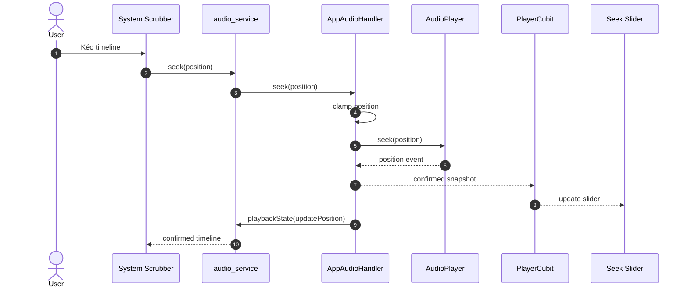
```mermaid
sequenceDiagram
autonumber
actor User
participant OS as System Scrubber
participant AS as audio_service
participant Handler as AppAudioHandler
participant Engine as AudioPlayer
participant Cubit as PlayerCubit
participant UI as Seek Slider

User->>OS: Kéo timeline
OS->>AS: seek(position)
AS->>Handler: seek(position)
Handler->>Handler: clamp position
Handler->>Engine: seek(position)
Engine-->>Handler: position event
Handler-->>Cubit: confirmed snapshot
Cubit-->>UI: update slider
Handler->>AS: playbackState(updatePosition)
AS-->>OS: confirmed timeline
```

UI và OS dùng cùng <code>AppAudioHandler.seek()</code>, vì vậy không cần cơ chế reconcile riêng.

## 12. Sequence Diagram — Tua ±10 giây

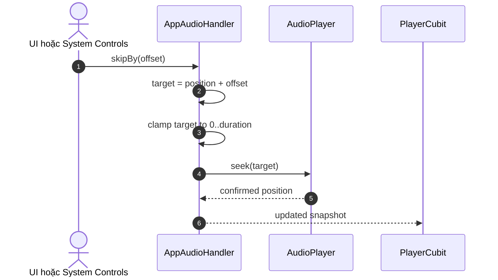
```mermaid
sequenceDiagram
autonumber
actor Caller as UI hoặc System Controls
participant Handler as AppAudioHandler
participant Engine as AudioPlayer
participant Cubit as PlayerCubit

Caller->>Handler: skipBy(offset)
Handler->>Handler: target = position + offset
Handler->>Handler: clamp target to 0..duration
Handler->>Engine: seek(target)
Engine-->>Handler: confirmed position
Handler-->>Cubit: updated snapshot
```

Rules:

- Rewind: offset = -10 giây.
- Fast-forward: offset = +10 giây.
- Không dùng Next/Previous để thay thế.
- Clamp tránh position âm hoặc vượt duration.

## 13. Sequence Diagram — Next/Previous trong queue

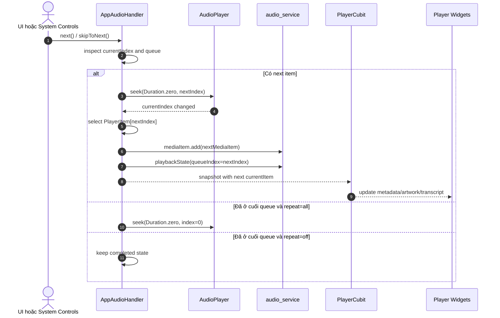
```mermaid
sequenceDiagram
autonumber
actor Caller as UI hoặc System Controls
participant Handler as AppAudioHandler
participant Engine as AudioPlayer
participant AS as audio_service
participant Cubit as PlayerCubit
participant UI as Player Widgets

Caller->>Handler: next() / skipToNext()
Handler->>Handler: inspect currentIndex and queue

alt Có next item
  Handler->>Engine: seek(Duration.zero, nextIndex)
  Engine-->>Handler: currentIndex changed
  Handler->>Handler: select PlayerItem[nextIndex]
  Handler->>AS: mediaItem.add(nextMediaItem)
  Handler->>AS: playbackState(queueIndex=nextIndex)
  Handler-->>Cubit: snapshot with next currentItem
  Cubit-->>UI: update metadata/artwork/transcript
else Đã ở cuối queue và repeat=all
  Handler->>Engine: seek(Duration.zero, index=0)
else Đã ở cuối queue và repeat=off
  Handler->>Handler: keep completed state
end
```

Previous policy đề xuất:

```text
Nếu position > 3 giây:
  seek về đầu current item
Ngược lại:
  chuyển previous item nếu có
```

Ngưỡng 3 giây là product policy và phải được constant hóa, không hard-code rải rác.

## 14. Sequence Diagram — Buffering và phục hồi

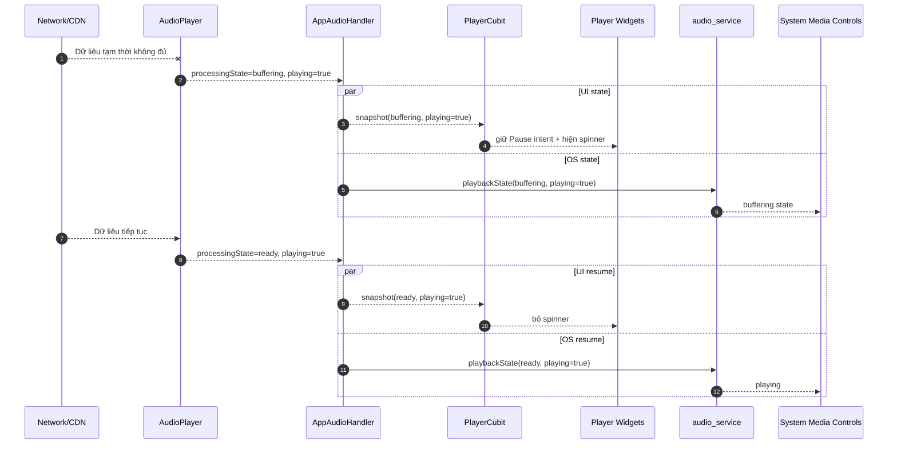
```mermaid
sequenceDiagram
autonumber
participant Network as Network/CDN
participant Engine as AudioPlayer
participant Handler as AppAudioHandler
participant Cubit as PlayerCubit
participant UI as Player Widgets
participant AS as audio_service
participant OS as System Media Controls

Network--xEngine: Dữ liệu tạm thời không đủ
Engine-->>Handler: processingState=buffering, playing=true

par UI state
  Handler-->>Cubit: snapshot(buffering, playing=true)
  Cubit-->>UI: giữ Pause intent + hiện spinner
and OS state
  Handler->>AS: playbackState(buffering, playing=true)
  AS-->>OS: buffering state
end

Network-->>Engine: Dữ liệu tiếp tục
Engine-->>Handler: processingState=ready, playing=true

par UI resume
  Handler-->>Cubit: snapshot(ready, playing=true)
  Cubit-->>UI: bỏ spinner
and OS resume
  Handler->>AS: playbackState(ready, playing=true)
  AS-->>OS: playing
end
```

Behavior contract:

- Buffering không đồng nghĩa Pause.
- Play/Pause icon vẫn thể hiện play intent.
- Spinner hoặc loading indicator thể hiện processing state.
- Không tự gọi Play lần thứ hai khi Ready trở lại.

## 15. Sequence Diagram — Hoàn thành track/queue

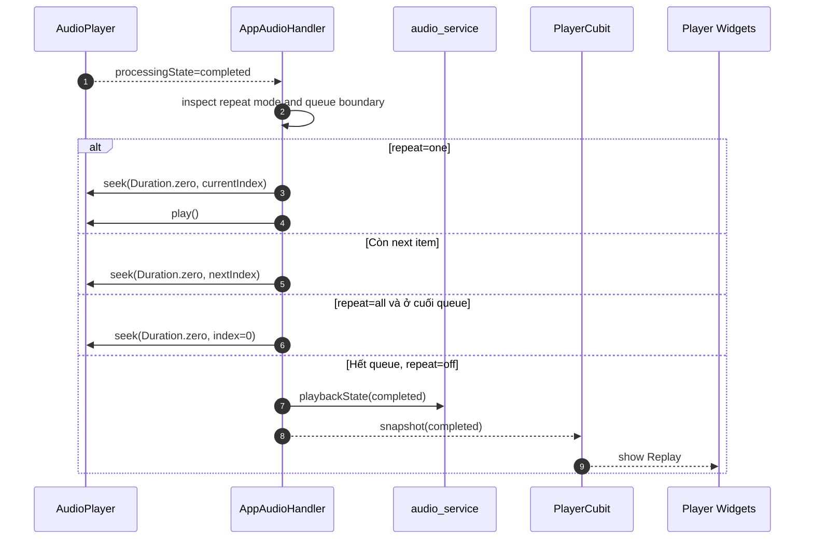
```mermaid
sequenceDiagram
autonumber
participant Engine as AudioPlayer
participant Handler as AppAudioHandler
participant AS as audio_service
participant Cubit as PlayerCubit
participant UI as Player Widgets

Engine-->>Handler: processingState=completed
Handler->>Handler: inspect repeat mode and queue boundary

alt repeat=one
  Handler->>Engine: seek(Duration.zero, currentIndex)
  Handler->>Engine: play()
else Còn next item
  Handler->>Engine: seek(Duration.zero, nextIndex)
else repeat=all và ở cuối queue
  Handler->>Engine: seek(Duration.zero, index=0)
else Hết queue, repeat=off
  Handler->>AS: playbackState(completed)
  Handler-->>Cubit: snapshot(completed)
  Cubit-->>UI: show Replay
end
```

Policy:

- Completed không tự clear current item.
- Người dùng vẫn thấy metadata và có thể Replay.
- Explicit Stop mới clear queue/current item và gỡ system card.

## 16. Sequence Diagram — Audio interruption

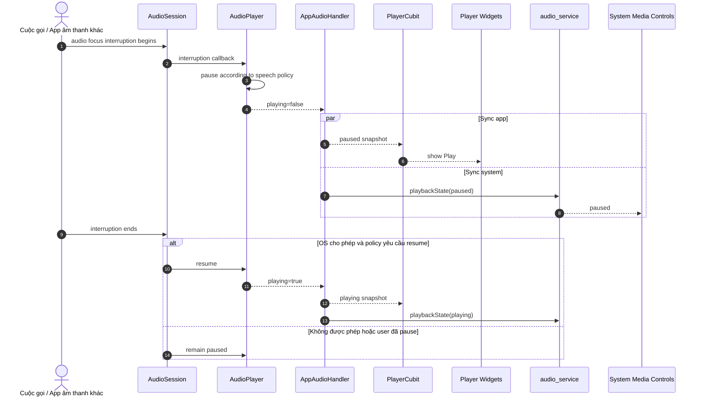
```mermaid
sequenceDiagram
autonumber
actor External as Cuộc gọi / App âm thanh khác
participant Session as AudioSession
participant Engine as AudioPlayer
participant Handler as AppAudioHandler
participant Cubit as PlayerCubit
participant UI as Player Widgets
participant AS as audio_service
participant OS as System Media Controls

External->>Session: audio focus interruption begins
Session->>Engine: interruption callback
Engine->>Engine: pause according to speech policy
Engine-->>Handler: playing=false

par Sync app
  Handler-->>Cubit: paused snapshot
  Cubit-->>UI: show Play
and Sync system
  Handler->>AS: playbackState(paused)
  AS-->>OS: paused
end

External->>Session: interruption ends

alt OS cho phép và policy yêu cầu resume
  Session->>Engine: resume
  Engine-->>Handler: playing=true
  Handler-->>Cubit: playing snapshot
  Handler->>AS: playbackState(playing)
else Không được phép hoặc user đã pause
  Session->>Engine: remain paused
end
```

Ownership rule:

- <code>just_audio</code> là owner xử lý interruption runtime.
- Ứng dụng cấu hình policy qua <code>audio_session</code>.
- Không tạo listener thứ hai để cùng pause/resume nếu engine đã xử lý.
- Auto-resume không được xảy ra nếu người dùng chủ động Pause trong lúc interruption.

## 17. Sequence Diagram — Rút tai nghe

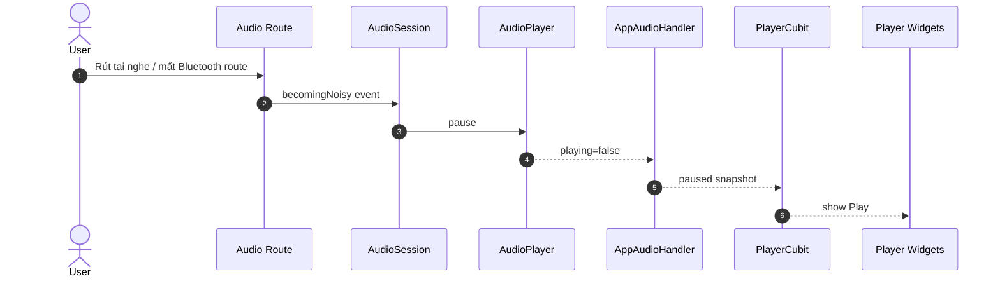
```mermaid
sequenceDiagram
autonumber
actor User
participant Device as Audio Route
participant Session as AudioSession
participant Engine as AudioPlayer
participant Handler as AppAudioHandler
participant Cubit as PlayerCubit
participant UI as Player Widgets

User->>Device: Rút tai nghe / mất Bluetooth route
Device->>Session: becomingNoisy event
Session->>Engine: pause
Engine-->>Handler: playing=false
Handler-->>Cubit: paused snapshot
Cubit-->>UI: show Play
```

Behavior contract:

- Becoming noisy luôn Pause để tránh phát loa ngoài bất ngờ.
- Không auto-resume khi người dùng cắm lại tai nghe.

## 18. Sequence Diagram — Error và Retry

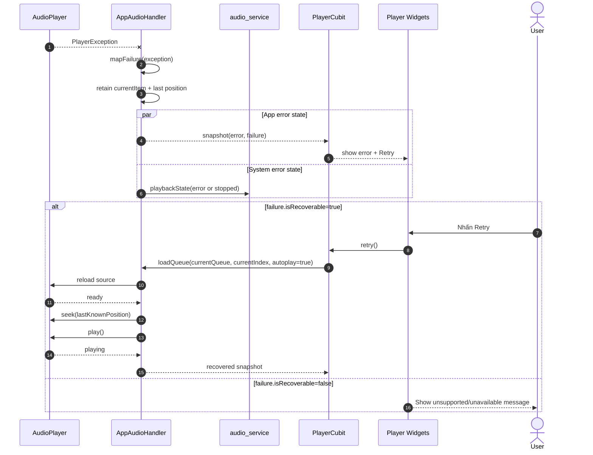
```mermaid
sequenceDiagram
autonumber
participant Engine as AudioPlayer
participant Handler as AppAudioHandler
participant AS as audio_service
participant Cubit as PlayerCubit
participant UI as Player Widgets
actor User

Engine--xHandler: PlayerException
Handler->>Handler: mapFailure(exception)
Handler->>Handler: retain currentItem + last position

par App error state
  Handler-->>Cubit: snapshot(error, failure)
  Cubit-->>UI: show error + Retry
and System error state
  Handler->>AS: playbackState(error or stopped)
end

alt failure.isRecoverable=true
  User->>UI: Nhấn Retry
  UI->>Cubit: retry()
  Cubit->>Handler: loadQueue(currentQueue, currentIndex, autoplay=true)
  Handler->>Engine: reload source
  Engine-->>Handler: ready
  Handler->>Engine: seek(lastKnownPosition)
  Handler->>Engine: play()
  Engine-->>Handler: playing
  Handler-->>Cubit: recovered snapshot
else failure.isRecoverable=false
  UI-->>User: Show unsupported/unavailable message
end
```

Behavior contract:

- Error state giữ metadata để UI giải thích track nào lỗi.
- Retry là hành động rõ ràng của người dùng nên có thể autoplay sau khi recover.
- Request retry vẫn phải tuân theo <code>loadGeneration</code>.
- Không tạo timer retry vô hạn.

## 19. Sequence Diagram — Hai request load cạnh tranh

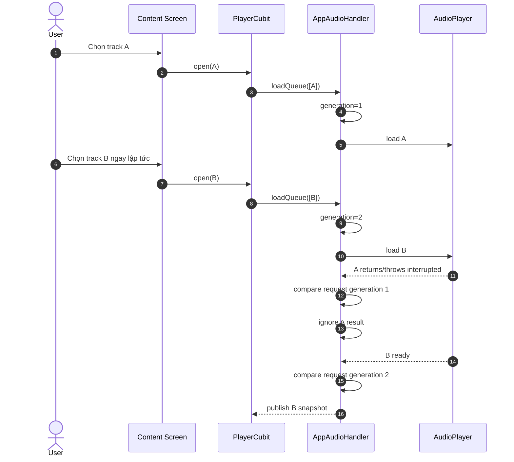
```mermaid
sequenceDiagram
autonumber
actor User
participant UI as Content Screen
participant Cubit as PlayerCubit
participant Handler as AppAudioHandler
participant Engine as AudioPlayer

User->>UI: Chọn track A
UI->>Cubit: open(A)
Cubit->>Handler: loadQueue([A])
Handler->>Handler: generation=1
Handler->>Engine: load A

User->>UI: Chọn track B ngay lập tức
UI->>Cubit: open(B)
Cubit->>Handler: loadQueue([B])
Handler->>Handler: generation=2
Handler->>Engine: load B

Engine-->>Handler: A returns/throws interrupted
Handler->>Handler: compare request generation 1
Handler->>Handler: ignore A result

Engine-->>Handler: B ready
Handler->>Handler: compare request generation 2
Handler-->>Cubit: publish B snapshot
```

Concurrency contract:

- Latest user intent wins.
- Interrupted error của request cũ không được hiển thị như lỗi của current item.
- Metadata A không được publish sau khi B đã được chọn.

## 20. Sequence Diagram — Stop và cleanup

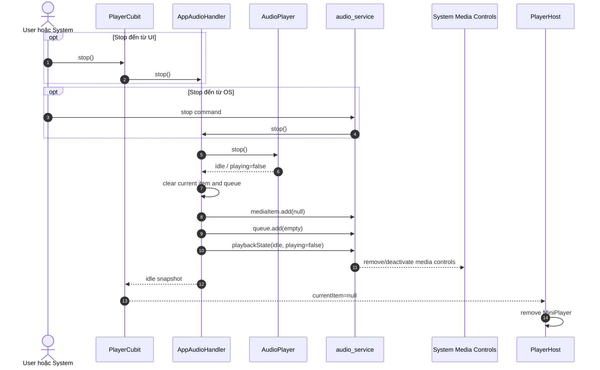
```mermaid
sequenceDiagram
autonumber
actor Caller as User hoặc System
participant Cubit as PlayerCubit
participant Handler as AppAudioHandler
participant Engine as AudioPlayer
participant AS as audio_service
participant OS as System Media Controls
participant Host as PlayerHost

opt Stop đến từ UI
  Caller->>Cubit: stop()
  Cubit->>Handler: stop()
end

opt Stop đến từ OS
  Caller->>AS: stop command
  AS->>Handler: stop()
end

Handler->>Engine: stop()
Engine-->>Handler: idle / playing=false
Handler->>Handler: clear current item and queue
Handler->>AS: mediaItem.add(null)
Handler->>AS: queue.add(empty)
Handler->>AS: playbackState(idle, playing=false)
AS-->>OS: remove/deactivate media controls
Handler-->>Cubit: idle snapshot
Cubit-->>Host: currentItem=null
Host->>Host: remove MiniPlayer
```

Behavior contract:

- Stop khác Pause.
- Pause giữ current item/system card.
- Stop clear current item, queue và system card.
- Stop không dispose handler singleton; app có thể load nội dung mới sau đó.

## 21. Sequence Diagram — Mở/đóng Expanded Player

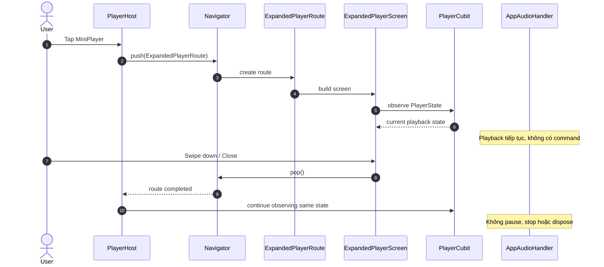
```mermaid
sequenceDiagram
autonumber
actor User
participant Host as PlayerHost
participant Nav as Navigator
participant Route as ExpandedPlayerRoute
participant Screen as ExpandedPlayerScreen
participant Cubit as PlayerCubit
participant Handler as AppAudioHandler

User->>Host: Tap MiniPlayer
Host->>Nav: push(ExpandedPlayerRoute)
Nav->>Route: create route
Route->>Screen: build screen
Screen->>Cubit: observe PlayerState
Cubit-->>Screen: current playback state

Note over Handler: Playback tiếp tục, không có command

User->>Screen: Swipe down / Close
Screen->>Nav: pop()
Nav-->>Host: route completed
Host->>Cubit: continue observing same state

Note over Handler: Không pause, stop hoặc dispose
```

Behavior contract:

- Expanded/minimized là navigation behavior.
- Không có <code>cubit.expand()</code> hoặc <code>cubit.minimize()</code> trong target design.
- Route dispose chỉ dispose sheet/animation controllers của màn hình.

## 22. Sequence Diagram — App background/foreground

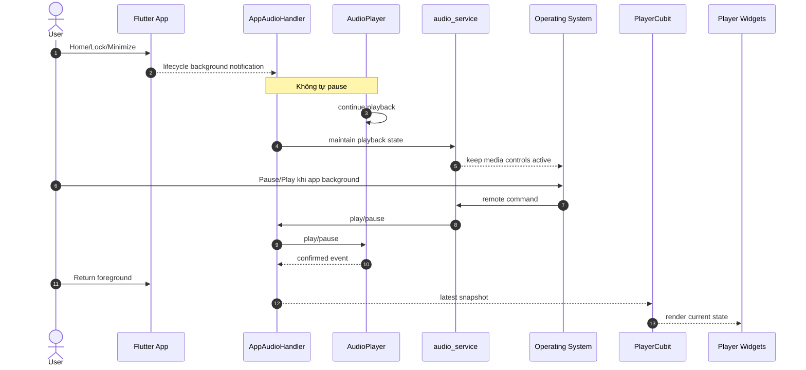
```mermaid
sequenceDiagram
autonumber
actor User
participant App as Flutter App
participant Handler as AppAudioHandler
participant Engine as AudioPlayer
participant AS as audio_service
participant OS as Operating System
participant Cubit as PlayerCubit
participant UI as Player Widgets

User->>App: Home/Lock/Minimize
App-->>Handler: lifecycle background notification
Note over Handler,Engine: Không tự pause
Engine->>Engine: continue playback
Handler->>AS: maintain playback state
AS-->>OS: keep media controls active

User->>OS: Pause/Play khi app background
OS->>AS: remote command
AS->>Handler: play/pause
Handler->>Engine: play/pause
Engine-->>Handler: confirmed event

User->>App: Return foreground
Handler-->>Cubit: latest snapshot
Cubit-->>UI: render current state
```

Platform notes:

- Android/iOS: tiếp tục phát khi background/lock theo cấu hình.
- Web: phụ thuộc browser; đóng tab kết thúc.
- macOS: minimize tiếp tục; đóng cửa sổ cuối kết thúc theo scope hiện tại.

## 23. State Machine — Processing lifecycle

<code>processingState</code> mô tả tình trạng decoder/source, không mô tả riêng ý định Play/Pause.

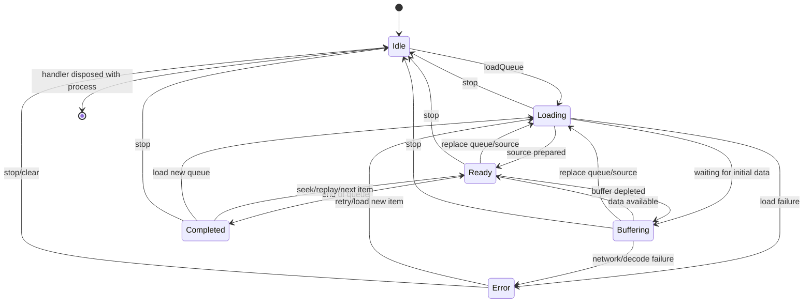
```mermaid
stateDiagram-v2
[*] --> Idle

Idle --> Loading: loadQueue
Loading --> Ready: source prepared
Loading --> Buffering: waiting for initial data
Loading --> Error: load failure

Ready --> Buffering: buffer depleted
Buffering --> Ready: data available
Buffering --> Error: network/decode failure

Ready --> Completed: end of queue
Completed --> Ready: seek/replay/next item

Ready --> Loading: replace queue/source
Buffering --> Loading: replace queue/source
Completed --> Loading: load new queue
Error --> Loading: retry/load new item

Loading --> Idle: stop
Ready --> Idle: stop
Buffering --> Idle: stop
Completed --> Idle: stop
Error --> Idle: stop/clear

Idle --> [*]: handler disposed with process
```

Transition rules:

- <code>Pause</code> không thay processing state nếu engine vẫn ready.
- <code>Play</code> không mặc định chuyển processing state; có thể vẫn buffering.
- <code>Stop</code> đưa processing state về idle.
- <code>Completed</code> giữ current item đến khi replay, load mới hoặc stop.

## 24. State Machine — Play intent

<code>playing</code> là trục độc lập với processing state.

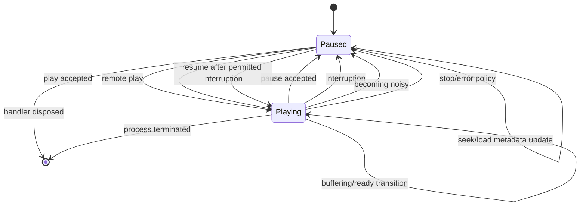
```mermaid
stateDiagram-v2
[*] --> Paused

Paused --> Playing: play accepted
Playing --> Paused: pause accepted
Playing --> Paused: interruption
Playing --> Paused: becoming noisy
Playing --> Paused: stop/error policy

Paused --> Playing: remote play
Paused --> Playing: resume after permitted interruption

Playing --> Playing: buffering/ready transition
Paused --> Paused: seek/load metadata update

Paused --> [*]: handler disposed
Playing --> [*]: process terminated
```

Full runtime state là tích Descartes:

```text
PlaybackState = ProcessingState × PlayIntent

Ví dụ:
ready × playing      → đang phát bình thường
buffering × playing  → đang muốn phát nhưng chờ dữ liệu
ready × paused       → pause và có thể resume ngay
completed × playing  → tới cuối, hiển thị Replay
error × paused       → lỗi, có thể Retry
```

## 25. State Machine — Media session lifecycle

```mermaid
stateDiagram-v2
[*] --> Inactive

Inactive --> Prepared: AudioService.init
Prepared --> Published: currentItem available
Published --> Playing: playbackState.playing=true
Playing --> Paused: pause/interruption
Paused --> Playing: play/resume

Playing --> Published: completed
Paused --> Published: metadata/state update
Published --> Playing: replay

Playing --> Inactive: stop
Paused --> Inactive: stop
Published --> Inactive: stop/clear item

Inactive --> [*]: process ends
```

System card policy:

| Session state | System card |
|---|---|
| Inactive | Không hiển thị |
| Prepared/Published | Có metadata và controls |
| Playing | Hiển thị playing |
| Paused | Vẫn hiển thị để resume |
| Stop → Inactive | Bị gỡ |

## 26. State Machine — Queue/current item

```mermaid
stateDiagram-v2
[*] --> Empty

Empty --> LoadingQueue: loadQueue
LoadingQueue --> ActiveItem: latest load ready
LoadingQueue --> LoadingQueue: newer load replaces old
LoadingQueue --> Empty: stop/load failure without item

ActiveItem --> ActiveItem: seek/speed/play/pause
ActiveItem --> SwitchingItem: next/previous/index change
SwitchingItem --> ActiveItem: new item ready
SwitchingItem --> ErrorItem: item load error

ActiveItem --> CompletedQueue: last item completed
CompletedQueue --> ActiveItem: replay/repeat/new index
ErrorItem --> LoadingQueue: retry

ActiveItem --> Empty: stop
CompletedQueue --> Empty: stop
ErrorItem --> Empty: stop
```

## 27. State Machine — Expanded player route

```mermaid
stateDiagram-v2
[*] --> MiniOnly
MiniOnly --> ExpandedOpening: tap mini
ExpandedOpening --> ExpandedVisible: route animation completed
ExpandedVisible --> TranscriptExpanded: drag transcript sheet up
TranscriptExpanded --> ExpandedVisible: collapse transcript sheet
ExpandedVisible --> ExpandedClosing: close/swipe down
TranscriptExpanded --> ExpandedClosing: close
ExpandedClosing --> MiniOnly: route pop completed
MiniOnly --> Hidden: currentItem becomes null
ExpandedVisible --> Hidden: stop then route closes
Hidden --> MiniOnly: load item
```

Route state và playback state độc lập. Chỉ điều kiện <code>currentItem == null</code> quyết định mini player có tồn tại hay không.

## 28. Activity Diagram — Unified command routing

Mermaid không có cú pháp UML Activity riêng; sơ đồ flowchart dưới đây biểu diễn Activity Diagram.

```mermaid
flowchart TD
    A([Command bắt đầu]) --> B{Nguồn command?}
    B -->|UI| C[Player widget gọi PlayerCubit]
    C --> D[PlayerCubit delegate PlaybackGateway]
    B -->|OS| E[audio_service gọi AudioHandler callback]
    D --> F[AppAudioHandler nhận command]
    E --> F
    F --> G{Command hợp lệ với current state?}
    G -->|Không| H[Return hoặc báo domain failure]
    G -->|Có| I[Điều khiển AudioPlayer]
    I --> J[Chờ engine stream]
    J --> K[Build PlaybackSnapshot]
    K --> L[Emit PlayerCubit state]
    K --> M[Broadcast audio_service state]
    L --> N[UI render]
    M --> O[System controls render]
    H --> P([Kết thúc])
    N --> P
    O --> P
```

Điểm quyết định:

- Có current item không?
- Command có hợp lệ ở queue boundary không?
- Seek target có duration hợp lệ không?
- Request load có còn là latest generation không?

## 29. Activity Diagram — Load queue

```mermaid
flowchart TD
    A([OpenQueue]) --> B[Validate items và initialIndex]
    B --> C{Input hợp lệ?}
    C -->|Không| D[Emit validation failure]
    C -->|Có| E[Increment loadGeneration]
    E --> F[Emit loading snapshot]
    F --> G[Map PlayerItem sang MediaItem]
    G --> H[Map PlayerItem sang AudioSource]
    H --> I[AudioPlayer.setAudioSources]
    I --> J{Load thành công?}
    J -->|Không| K{Interrupted bởi load mới?}
    K -->|Có| L[Ignore stale result]
    K -->|Không| M[Map và emit failure]
    J -->|Có| N{Generation vẫn mới nhất?}
    N -->|Không| L
    N -->|Có| O[Publish queue + current item]
    O --> P[Emit ready snapshot]
    P --> Q{Autoplay?}
    Q -->|Có| R[AudioPlayer.play]
    Q -->|Không| S([Ready paused])
    R --> T([Ready playing])
    D --> U([Kết thúc])
    L --> U
    M --> U
```

## 30. Activity Diagram — Xử lý engine event

```mermaid
flowchart TD
    A([Engine event]) --> B{Loại event}

    B -->|Player state| C[Map playing + processing state]
    B -->|Position| D[Update position]
    B -->|Buffered position| E[Update bufferedPosition]
    B -->|Duration| F[Update duration]
    B -->|Current index| G[Select current PlayerItem]
    B -->|Speed/loop/shuffle| H[Update playback options]
    B -->|Error| I[Map PlayerFailure]

    C --> J[Build latest PlaybackSnapshot]
    D --> J
    E --> J
    F --> J
    G --> K[Publish MediaItem to audio_service]
    K --> J
    H --> J
    I --> J

    J --> L{Snapshot khác snapshot trước?}
    L -->|Không| M([Bỏ qua duplicate])
    L -->|Có| N[Emit snapshot to Cubit]
    N --> O{OS-relevant fields changed?}
    O -->|Có| P[Broadcast PlaybackState/MediaItem]
    O -->|Không| Q([Kết thúc])
    P --> Q
```

## 31. Activity Diagram — Seek

```mermaid
flowchart TD
    A([Seek request]) --> B{Có current item?}
    B -->|Không| C[Ignore hoặc return failure]
    B -->|Có| D{Duration đã biết và > 0?}
    D -->|Không| E[Disable/reject seek]
    D -->|Có| F[Clamp target 0..duration]
    F --> G[AudioPlayer.seek]
    G --> H{Engine confirm?}
    H -->|Có| I[Emit confirmed position]
    H -->|Lỗi| J[Map PlayerFailure]
    I --> K[Update OS timeline]
    C --> L([Kết thúc])
    E --> L
    J --> L
    K --> L
```

## 32. Activity Diagram — Error recovery

```mermaid
flowchart TD
    A([Playback error]) --> B[Normalize PlayerFailure]
    B --> C[Retain item, queue và last position]
    C --> D[Emit error snapshot]
    D --> E[Update system playback state]
    E --> F{Recoverable?}
    F -->|Không| G[Show terminal message]
    F -->|Có| H[Show Retry]
    H --> I{User taps Retry?}
    I -->|Không| J([Remain error])
    I -->|Có| K[Start new loadGeneration]
    K --> L[Reload current queue/item]
    L --> M{Ready?}
    M -->|Không| B
    M -->|Có| N[Seek last known position]
    N --> O[Play]
    O --> P([Recovered])
    G --> Q([Kết thúc])
```

## 33. Activity Diagram — Stop

```mermaid
flowchart TD
    A([Stop]) --> B[AudioPlayer.stop]
    B --> C[Set playing=false và processing=idle]
    C --> D[Clear current item]
    D --> E[Clear queue/index]
    E --> F[Publish null media item]
    F --> G[Publish empty queue]
    G --> H[Deactivate/remove system media controls]
    H --> I[Emit idle snapshot]
    I --> J[PlayerHost removes MiniPlayer]
    J --> K([Handler remains reusable])
```

## 34. Concurrency và Ordering Contracts

### 34.1. Latest load wins

Mỗi <code>loadQueue</code> nhận một generation tăng dần. Result chỉ được commit nếu generation của request bằng generation hiện tại.

### 34.2. Command serialization

Các command thay source/queue cần được serialize:

- loadQueue.
- stop trong khi loading.
- retry.
- next/previous trong khi switching item.

Play/Pause/Seek không được giữ lock dài hơn platform call cần thiết.

### 34.3. State ordering

Thứ tự tối thiểu khi load thành công:

```text
loading
→ queue/current item published
→ ready
→ playing nếu autoplay
```

Thứ tự khi Stop:

```text
engine stopped
→ playback idle
→ media item cleared
→ queue cleared
→ system card removed
→ Cubit idle
```

### 34.4. Duplicate suppression

Không emit snapshot mới nếu tất cả fields có ý nghĩa đều giống snapshot trước.

Không publish lại:

- Artwork trên mỗi position tick.
- Queue trên mỗi play/pause.
- MediaItem trên mỗi buffering event.

## 35. Timing và Performance Contracts

| Hành vi | Mục tiêu |
|---|---|
| UI position update | Khoảng 200 ms |
| Remote Play/Pause phản ánh lên UI | Dưới khoảng 500 ms |
| Seek commit | Một platform call cho mỗi drag |
| Metadata publication | Khi current item/metadata đổi |
| Queue publication | Khi queue/order đổi |
| Artwork rebuild | Không theo position |
| Transcript active cue | Derived từ position, chỉ rebuild vùng cue |
| System timeline | Dùng updatePosition/updateTime/speed để nội suy |

Nếu platform stream phát event dày hơn UI cần, throttle ở projection stream hoặc selector; không làm mất event lifecycle quan trọng.

## 36. Platform Behavior Matrix

| Hành vi | Android | iOS | Web | macOS |
|---|---|---|---|---|
| Background playback | Có | Có | Best effort | Có khi process sống |
| Lock/system controls | Media controls | Now Playing | Media Session tùy browser | Control Center |
| Remote Play/Pause | Có | Có | Tùy browser | Có |
| Seek | Có | Có | Tùy browser | Có |
| Headset/media keys | Có | Có | Tùy browser/device | Có |
| Audio interruption | Audio focus | AVAudioSession | Browser policy | Hạn chế theo OS |
| Đóng app/tab/window | Theo service policy | Process kết thúc | Tab đóng là kết thúc | Cửa sổ cuối đóng là kết thúc trong scope hiện tại |

Behavior fallback:

- Web không có Media Session: UI player vẫn hoạt động.
- Browser chặn autoplay: hiển thị Play và chờ user gesture.
- Artwork OS load lỗi: playback vẫn tiếp tục với metadata text.
- Không có duration: disable scrubber, vẫn cho Play/Pause.

## 37. Observable Logging Events

Các event nên log có cấu trúc để debug hành vi:

| Event name | Fields chính |
|---|---|
| <code>player_load_started</code> | itemId, generation, index |
| <code>player_load_ready</code> | itemId, duration, latency |
| <code>player_play</code> | itemId, position, source |
| <code>player_pause</code> | itemId, position, source |
| <code>player_seek</code> | from, to, source |
| <code>player_item_changed</code> | oldItemId, newItemId, reason |
| <code>player_buffering_started</code> | itemId, position |
| <code>player_buffering_ended</code> | itemId, durationMs |
| <code>player_interrupted</code> | type, position |
| <code>player_error</code> | code, itemId, recoverable |
| <code>player_stopped</code> | itemId, reason |

<code>source</code> phân biệt:

- ui.
- lock_screen.
- notification.
- headset.
- control_center.
- web_media_session.
- interruption.

Logging không được làm thay đổi command path hoặc trở thành dependency bắt buộc của playback.

## 38. Behavioral Test Scenarios

### 38.1. UI Play/Pause

```gherkin
Given một item đã ready và đang paused
When người dùng nhấn Play
Then Cubit delegate play đúng một lần
And UI chưa đổi trước engine confirmation
And engine emit playing
And UI cùng system controls chuyển sang playing
```

### 38.2. Remote Pause

```gherkin
Given app đang background và audio đang phát
When người dùng nhấn Pause trên lock screen
Then audio_service gọi AppAudioHandler.pause
And AudioPlayer pause
And khi app foreground trở lại UI hiển thị paused
```

### 38.3. Buffering

```gherkin
Given playing=true và processingState=ready
When engine chuyển sang buffering
Then playing vẫn true
And UI hiện buffering
And nút chính vẫn thể hiện Pause intent
When engine trở lại ready
Then UI bỏ buffering mà không gọi play lần nữa
```

### 38.4. Seek drag

```gherkin
Given track có duration hợp lệ
When người dùng kéo slider qua nhiều vị trí
Then UI cập nhật local preview
And gateway chưa nhận seek
When người dùng thả slider
Then gateway nhận đúng một seek với position cuối
```

### 38.5. Latest load wins

```gherkin
Given load A đang chạy
When load B bắt đầu trước khi A hoàn tất
And A hoàn tất sau B
Then current item vẫn là B
And metadata A không được publish
And interrupted result A không trở thành UI error
```

### 38.6. Stop

```gherkin
Given một item đang phát
When Stop được gọi
Then engine dừng
And current item và queue được clear
And system media controls biến mất
And mini player biến mất
And handler vẫn có thể load item mới
```

## 39. Traceability Matrix

| Behavior | Sequence | State Machine | Activity | Class chịu trách nhiệm |
|---|---:|---:|---:|---|
| Bootstrap | 5 | 25 | — | main, AudioService, AppAudioHandler |
| Load/autoplay | 6 | 23, 26 | 29 | PlayerCubit, AppAudioHandler |
| UI Play/Pause | 7 | 24 | 28 | PlayerCubit, AppAudioHandler |
| Remote Play/Pause | 8 | 24, 25 | 28 | audio_service, AppAudioHandler |
| Position sync | 9 | 23, 24 | 30 | AudioPlayer, AppAudioHandler |
| Slider seek | 10 | 23 | 31 | PlayerControlDock, Handler |
| Remote seek | 11 | 23 | 31 | audio_service, Handler |
| Skip ±10s | 12 | 23 | 31 | Handler |
| Next/Previous | 13 | 26 | 28 | Handler |
| Buffering | 14 | 23 | 30 | AudioPlayer, Handler |
| Completion | 15 | 23, 26 | 30 | Handler |
| Interruption | 16 | 24 | 30 | AudioSession, AudioPlayer |
| Becoming noisy | 17 | 24 | 30 | AudioSession, AudioPlayer |
| Error/Retry | 18 | 23, 26 | 32 | Handler, PlayerCubit |
| Load race | 19 | 26 | 29 | Handler |
| Stop | 20 | 23, 25, 26 | 33 | Handler |
| Expanded route | 21 | 27 | — | Navigator, PlayerHost |
| Background | 22 | 25 | 28 | audio_service, Handler |

## 40. Behavioral Review Checklist

- [ ] UI command và OS command hội tụ vào cùng handler operation.
- [ ] UI không đổi playing trước engine event.
- [ ] Buffering và playing được biểu diễn độc lập.
- [ ] Position đến từ engine stream.
- [ ] Slider chỉ seek khi drag kết thúc.
- [ ] Metadata không publish theo position tick.
- [ ] Remote command hoạt động khi UI background.
- [ ] Current snapshot khôi phục UI khi app foreground.
- [ ] Latest load wins.
- [ ] Stale load result không tạo UI error.
- [ ] Repeat one/all/off có behavior được kiểm thử.
- [ ] Previous policy dùng một constant chung.
- [ ] Completed giữ metadata và cho phép Replay.
- [ ] Pause giữ system card.
- [ ] Stop clear system card, queue và mini player.
- [ ] Interruption chỉ có một owner.
- [ ] Becoming noisy luôn Pause và không auto-resume.
- [ ] Route push/pop không gửi playback command.
- [ ] Handler không dispose khi expanded route dispose.
- [ ] Web có graceful fallback khi không có Media Session.

## 41. Kết luận

Cấu trúc động mục tiêu được rút gọn thành hai phương trình:

```text
Command path:
(UI Intent ∪ OS Intent)
→ AppAudioHandler
→ AudioPlayer
```

```text
State path:
AudioPlayer Event
→ AppAudioHandler
→ (PlaybackSnapshot ∪ audio_service.PlaybackState)
→ (PlayerCubit/UI ∪ System Media Controls)
```

Sequence Diagram bảo đảm thứ tự message rõ ràng. State Machine Diagram bảo đảm mọi chuyển trạng thái hợp lệ. Activity Diagram bảo đảm các nhánh validation, race, error và cleanup có một đường xử lý duy nhất.
