# Player Architecture — Behavioral Diagrams

> Loại tài liệu: Mô tả hành vi và cấu trúc động<br>
> Trạng thái: Target design, chưa phải hiện trạng đã implement<br>
> Phạm vi: Android, iOS, Web và macOS<br>
> Stack: <code>just_audio + audio_service + audio_session + flutter_bloc</code><br>
> Cập nhật: 2026-08-02<br>
> Contract normative: [Player Architecture Decisions](./player-architecture-decisions.md)

Tài liệu liên quan:

- [Kế hoạch triển khai Player](./player-implementation-plan.md)
- [Player Class Diagram](./player-class-diagram.md)
- [Player Architecture Decisions](./player-architecture-decisions.md)

## 1. Mục đích

Class Diagram trả lời câu hỏi “hệ thống có những lớp nào và chúng liên hệ với nhau ra sao”. Tài liệu này trả lời các câu hỏi động:

- Khi người dùng nhấn Play, message đi qua những object nào?
- Khi lock screen gửi Pause, vì sao UI vẫn đồng bộ?
- Khi engine buffering, state thay đổi theo thứ tự nào?
- Khi người dùng kéo seek bar, lúc nào mới gọi platform?
- Khi có cuộc gọi hoặc rút tai nghe, object nào chịu trách nhiệm?
- Khi hai request load xảy ra gần nhau, request nào thắng?
- Khi Stop, hệ thống dọn queue, notification và mini player theo thứ tự nào?

Ba loại biểu đồ được sử dụng:

| Biểu đồ | Góc nhìn |
|---|---|
| Sequence Diagram | Message/call giữa object theo trục thời gian |
| State Machine Diagram | Vòng đời và chuyển trạng thái |
| Activity Diagram | Luồng bước, decision và nhánh nghiệp vụ |

## 2. Nguyên tắc hành vi cốt lõi

```text
Command:
UI → PlayerCubit → PlaybackGateway/UI adapter
OS → BaseAudioHandler callback
→ cùng internal AppAudioHandler operation
→ AudioPlayer

State:
AudioPlayer streams
→ AppAudioHandler
→ PlaybackGateway snapshot + audio_service
→ PlayerCubit + system media session
→ UI + System Media Controls
```

Các invariant:

1. Mọi command cuối cùng đi vào cùng một <code>AudioPlayer</code>.
2. UI không tự xác nhận thành công của command.
3. State chỉ thay đổi chính thức sau event từ engine.
4. Remote command không bắt buộc Cubit/UI đang tồn tại.
5. Route navigation không điều khiển audio lifecycle.
6. Position không được mô phỏng bằng timer trong Cubit.
7. Queue và current item chỉ được thay đổi bởi <code>AppAudioHandler</code>.
8. Mọi policy/ordering trong diagram này phải khớp decision record `Accepted`.
9. Pending load chưa commit không được publish như active metadata.

## 3. Các participant trong cấu trúc động

| Participant | Vai trò khi runtime |
|---|---|
| User | Người dùng thao tác trong app |
| System Media Controls | Android notification/lock screen, iOS Now Playing, Web Media Session, macOS Control Center |
| Player widgets | MiniPlayer, ExpandedPlayerScreen, PlayerControlDock |
| PlayerCubit | Nhận UI intent, delegate command, phát UI state |
| PlaybackGateway | Contract mà Cubit dùng để giao tiếp với playback |
| UiPlaybackGatewayAdapter | Gắn source `ui` và forward Gateway command vào internal handler operation |
| AppAudioHandler | Trung tâm xử lý command, mapping state và OS integration |
| PlaybackEngine | Internal port để handler điều khiển/quan sát engine |
| JustAudioPlaybackEngine | Production adapter duy nhất của PlaybackEngine |
| AudioPlayer | just_audio engine duy nhất, do JustAudioPlaybackEngine sở hữu |
| AudioService | Bridge giữa AppAudioHandler và hệ điều hành |
| AudioSession | Audio focus/interruption configuration |
| Navigator | Sở hữu expanded player route |

Để diagram dễ đọc, các mũi tên `Handler → Cubit` ở phần sau là ký hiệu rút gọn
cho snapshot path `Handler → UiPlaybackGatewayAdapter → PlayerCubit`; command UI
không bao giờ bypass Gateway adapter. Tương tự, `Handler → AudioPlayer` là ký
hiệu rút gọn cho `Handler → PlaybackEngine → JustAudioPlaybackEngine → AudioPlayer`.

## 4. Event Vocabulary

### 4.1. UI intents

| Event | Payload | Nguồn |
|---|---|---|
| <code>OpenItem</code> | PlayerItem, autoplay | Content card |
| <code>OpenQueue</code> | items, index, autoplay | Playlist/course |
| <code>Play</code> | Không | Mini/Dock |
| <code>Pause</code> | Không | Mini/Dock |
| <code>TogglePlayback</code> | Không | Mini/Dock |
| <code>SeekTo</code> | Duration | Slider commit |
| <code>SkipBy</code> | Duration offset | ±10 giây |
| <code>Next</code> | Không | Queue control |
| <code>Previous</code> | Không | Queue control |
| <code>SetSpeed</code> | double | Speed selector |
| <code>SetRepeatMode</code> | enum | Repeat control |
| <code>SetShuffle</code> | bool | Shuffle control |
| <code>Retry</code> | Không | Error UI |
| <code>Stop</code> | Không | Stop/close playback |

### 4.2. Engine events

| Event | Payload |
|---|---|
| <code>PlayerStateChanged</code> | playing + processingState |
| <code>PositionChanged</code> | Duration |
| <code>BufferedPositionChanged</code> | Duration |
| <code>DurationChanged</code> | Duration? |
| <code>CurrentIndexChanged</code> | int? |
| <code>SpeedChanged</code> | double |
| <code>LoopModeChanged</code> | LoopMode |
| <code>ShuffleChanged</code> | bool |
| <code>PlaybackError</code> | PlayerException |

### 4.3. System events

| Event | Nguồn |
|---|---|
| Remote Play/Pause | Lock screen, notification, headset |
| Remote Seek | System timeline/scrubber |
| Remote Next/Previous | Media controls |
| Remote Rewind/Fast-forward | Media controls |
| Audio focus loss | Android/iOS audio session |
| Audio focus regained | Android/iOS audio session |
| Becoming noisy | Rút tai nghe hoặc đổi route |
| App background/foreground | Flutter/platform lifecycle |

## 5. Sequence Diagram — Bootstrap ứng dụng

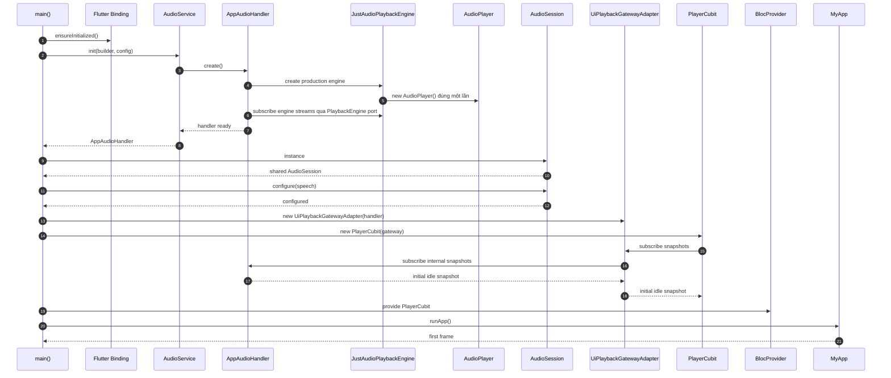

Behavior contract:

- <code>AudioService.init</code> hoàn tất trước <code>runApp</code>.
- Handler và AudioPlayer chỉ được tạo một lần.
- PlayerCubit chỉ nhận <code>UiPlaybackGatewayAdapter</code> qua interface
  <code>PlaybackGateway</code>; không nhận concrete handler.
- Initial snapshot là idle, không có current item.
- Mini player và system notification chưa xuất hiện khi idle.

Failure behavior:

- Development/test bootstrap failure fail-fast.
- Production bootstrap failure dùng <code>UnavailablePlaybackGateway</code> không
  sở hữu engine và phát snapshot <code>bootstrapUnavailable</code>.
- Không được tạo một AudioPlayer thứ hai để “chữa cháy”.

## 6. Sequence Diagram — Load queue và autoplay

```mermaid
sequenceDiagram
autonumber
actor User
participant UI as Content Screen
participant Cubit as PlayerCubit
participant Gateway as UiPlaybackGatewayAdapter
participant Handler as AppAudioHandler
participant Engine as AudioPlayer
participant AS as audio_service
participant OS as System Media Controls

User->>UI: Chọn một lesson/track
UI->>Cubit: openQueue(items, index, autoplay=true)
Cubit->>Gateway: loadQueue(items, index, true)
Gateway->>Handler: loadQueue operation(source=ui)

Handler->>Handler: validate + create pending context/generation
Handler->>Handler: emit loading without pending metadata
Handler-->>Cubit: PlaybackSnapshot(loading)
Cubit-->>UI: PlayerState(loading)

Handler->>Handler: map PlayerItem to MediaItem
Handler->>Handler: map PlayerItem to AudioSource
Handler->>Engine: setAudioSources(sources, initialIndex)
Engine-->>Handler: loading/duration/currentIndex/ready events
Handler->>Handler: buffer pending events; do not publish pending item

alt Request vẫn là generation mới nhất
  Handler->>Handler: atomic commit active queue/item/index
  Handler->>AS: queue.add(committedMediaItems)
  Handler->>AS: mediaItem.add(committedCurrentItem)
  Handler->>AS: playbackState.add(ready, paused)
  AS-->>OS: committed metadata + available controls
  Handler-->>Cubit: PlaybackSnapshot(ready, committed currentItem)
  Cubit-->>UI: Render metadata + mini player
  alt autoplay=true
    Handler->>Engine: play()
    Engine-->>Handler: playing=true
    Handler-->>Cubit: PlaybackSnapshot(playing)
    Handler->>AS: playbackState.add(playing)
    AS-->>OS: playing
  end
else Request đã stale
  Handler->>Handler: ignore late result
end
```

Behavior contract:

- Loading state xuất hiện trước khi engine ready.
- Engine load là prepare-only; handler chỉ gọi Play sau khi queue/item đã commit và
  Ready đã được publish.
- Queue OS và engine được tạo từ cùng một danh sách <code>PlayerItem</code>.
- Pending item/queue không được publish trước latest-ready commit.
- Current metadata đã commit được publish trước playback bắt đầu.
- Chỉ generation mới nhất được phép trở thành current queue.
- Cubit không tự emit current item trước khi handler xác nhận load.
- Replace A → B giữ outward metadata A cho tới khi B latest-ready; B failure tạo
  retry context B mà không masquerade B thành active item.

## 7. Sequence Diagram — Play/Pause từ UI

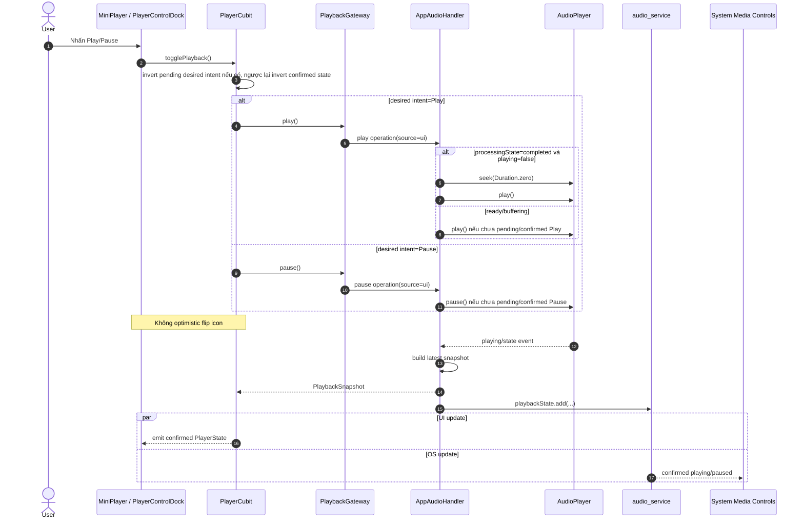

Behavior contract:

- UI button chỉ đổi icon khi engine stream xác nhận.
- Nếu engine từ chối play do lỗi/focus, UI không bị kẹt ở trạng thái playing giả.
- Completed được chuẩn hóa thành <code>playing=false</code>; Replay thực hiện đúng
  một <code>seek → play</code>.
- Private pending desired intent chỉ route rapid Toggle; không được emit thành
  optimistic PlayerState.

## 8. Sequence Diagram — Play/Pause từ Lock Screen

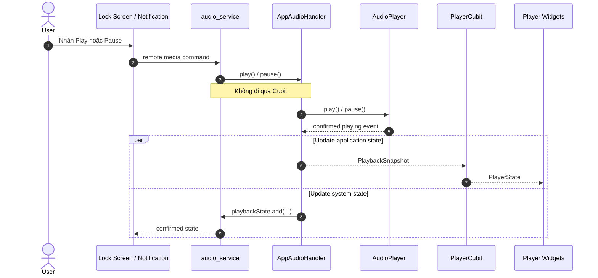

Behavior contract:

- Remote command hoạt động khi UI đang background.
- Cubit có thể chưa tồn tại trong một số cold-start/background context; handler vẫn xử lý được.
- Khi UI quay lại, latest snapshot phải khôi phục đúng state.
- Không để OS và UI gọi hai engine instance khác nhau.

## 9. Sequence Diagram — Đồng bộ position liên tục

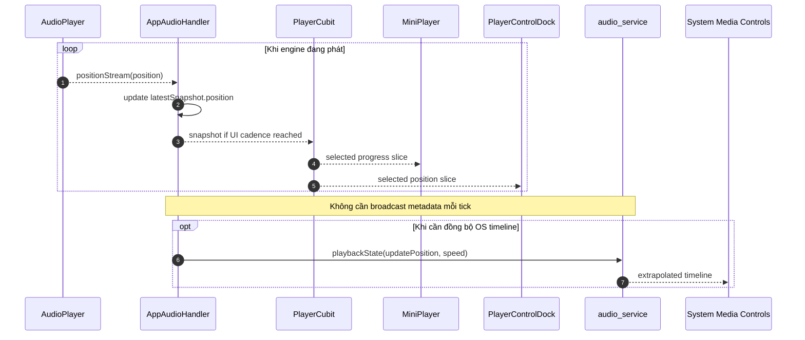

Timing policy:

- UI position cadence mục tiêu: khoảng 200 ms.
- OS position-only resync mục tiêu: khoảng 1 giây; immediate event không đợi cadence.
- Mini player có thể dùng selector thưa hơn expanded seek bar.
- Metadata chỉ publish khi track/metadata thay đổi.
- System timeline dùng update position + update time + speed để nội suy; không spam platform channel mỗi frame.
- Không rebuild artwork, transcript hoặc toàn screen theo position tick.

## 10. Sequence Diagram — Seek từ slider

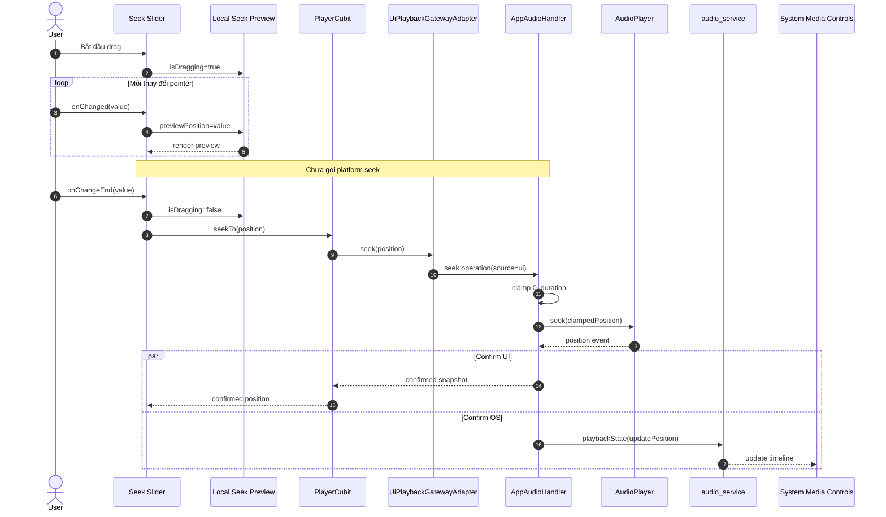

Behavior contract:

- Không gọi seek trên từng pixel.
- Preview là presentation state cục bộ, không phải playback state.
- Sau khi commit, engine position ghi đè preview.
- Nếu duration bằng 0 hoặc unknown, slider disabled/indeterminate; direct command
  trả <code>seekUnavailableUnknownDuration</code> và không gọi engine.

## 11. Sequence Diagram — Remote seek

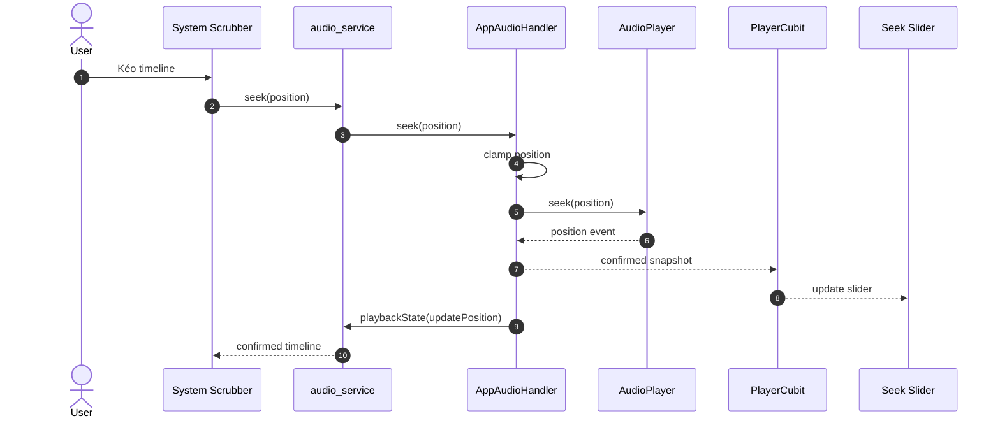

UI adapter và OS override hội tụ vào cùng internal seek operation của handler,
vì vậy không cần cơ chế reconcile riêng.

## 12. Sequence Diagram — Tua ±10 giây

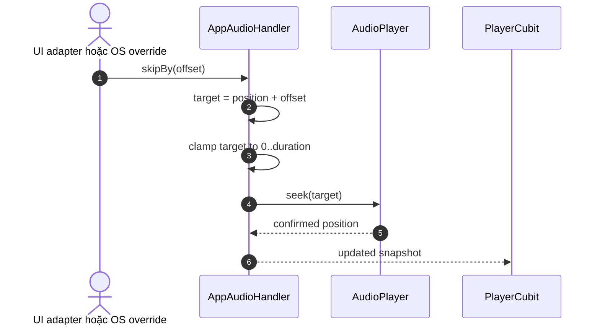

Rules:

- Rewind: offset = -10 giây.
- Fast-forward: offset = +10 giây.
- Không dùng Next/Previous để thay thế.
- Clamp tránh position âm hoặc vượt duration.
- Không có item hoặc duration unknown/zero trả typed failure PLR-001 trước engine.

## 13. Sequence Diagram — Next/Previous trong queue

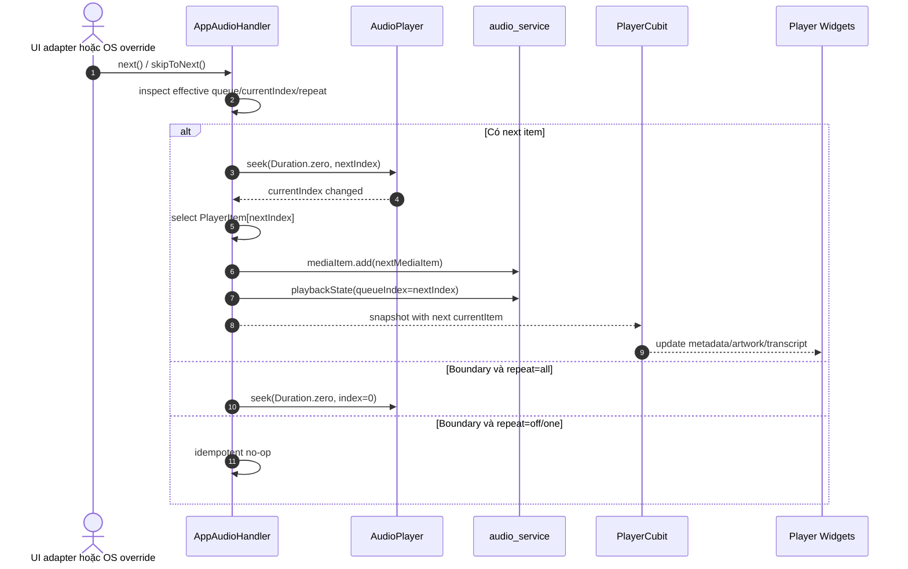

Previous policy canonical:

```text
Nếu position > 3 giây:
  seek về đầu current item
Ngược lại:
  chuyển previous item trong effective order nếu có
  nếu ở đầu và repeat=all thì wrap tới item cuối
  nếu ở đầu và repeat=off/one thì no-op
```

Ngưỡng 3 giây là Application policy dùng chung. Domain queue và OS queue cùng
publish effective order; repeat-one không chặn explicit navigation.

## 14. Sequence Diagram — Buffering và phục hồi

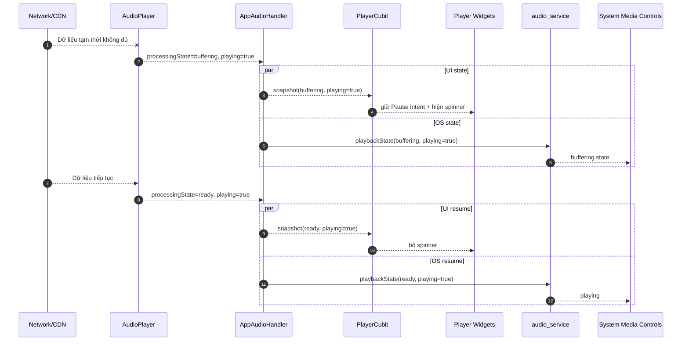

Behavior contract:

- Buffering không đồng nghĩa Pause.
- Play/Pause icon vẫn thể hiện play intent.
- Spinner hoặc loading indicator thể hiện processing state.
- Không tự gọi Play lần thứ hai khi Ready trở lại.

## 15. Sequence Diagram — Hoàn thành track/queue

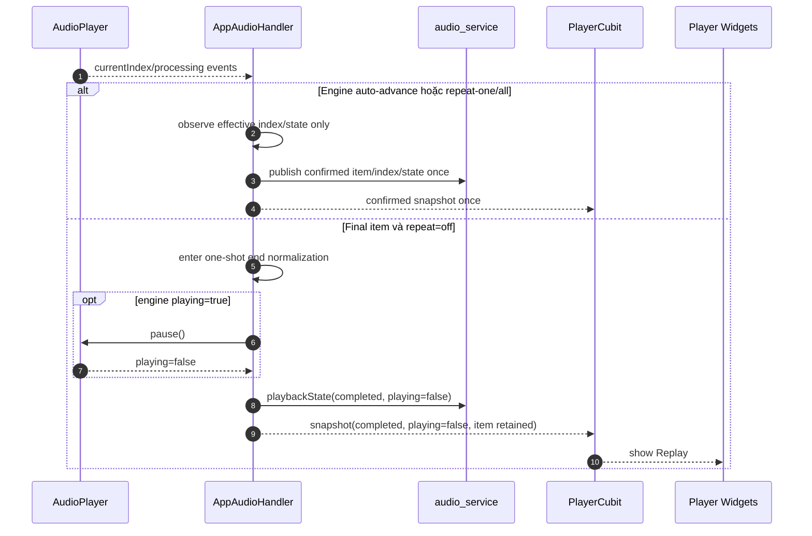

Policy:

- Completed không tự clear current item.
- Người dùng vẫn thấy metadata và có thể Replay.
- Engine là owner duy nhất auto-advance/repeat; handler không manual-seek trên
  completion path.
- Final repeat-off được normalize đúng một lần thành
  <code>completed × playing=false</code>.
- Replay là <code>seek(Duration.zero, currentIndex) → play()</code>.
- Explicit Stop mới clear queue/current item và gỡ system card.

## 16. Sequence Diagram — Audio interruption

```mermaid
sequenceDiagram
autonumber
actor External as Cuộc gọi / App âm thanh khác
participant Session as AudioSession
participant Engine as AudioPlayer
participant Handler as AppAudioHandler
participant Cubit as PlayerCubit
participant UI as Player Widgets
participant AS as audio_service
participant OS as System Media Controls

External->>Session: audio focus interruption begins
Session->>Engine: interruption callback
Engine->>Engine: pause according to speech policy
Engine-->>Handler: playing=false
Handler->>Handler: passive bookkeeping/log only; no second Pause

par Sync app
  Handler-->>Cubit: paused snapshot
  Cubit-->>UI: show Play
and Sync system
  Handler->>AS: playbackState(paused)
  AS-->>OS: paused
end

External->>Session: interruption ends

alt OS cho phép và policy yêu cầu resume
  Session->>Engine: resume
  Engine-->>Handler: playing=true
  Handler-->>Cubit: playing snapshot
  Handler->>AS: playbackState(playing)
else Không được phép hoặc user đã pause
  Session->>Engine: remain paused
end
```

Ownership rule:

- <code>just_audio</code> là owner xử lý interruption runtime.
- Ứng dụng cấu hình policy qua <code>audio_session</code>.
- Handler chỉ passive-observe; không tạo listener thứ hai gọi pause/resume.
- Auto-resume không được xảy ra nếu người dùng chủ động Pause trong lúc interruption.

## 17. Sequence Diagram — Rút tai nghe

```mermaid
sequenceDiagram
autonumber
actor User
participant Device as Audio Route
participant Session as AudioSession
participant Engine as AudioPlayer
participant Handler as AppAudioHandler
participant Cubit as PlayerCubit
participant UI as Player Widgets

User->>Device: Rút tai nghe / mất Bluetooth route
Device->>Session: becomingNoisy event
Session->>Engine: pause
Engine-->>Handler: playing=false
Handler->>Handler: clear resume eligibility; passive log only
Handler-->>Cubit: paused snapshot
Cubit-->>UI: show Play
```

Behavior contract:

- Becoming noisy luôn Pause để tránh phát loa ngoài bất ngờ.
- Không auto-resume khi người dùng cắm lại tai nghe hoặc route quay lại.
- Một noisy event tạo tối đa một engine Pause.

## 18. Sequence Diagram — Error và Retry

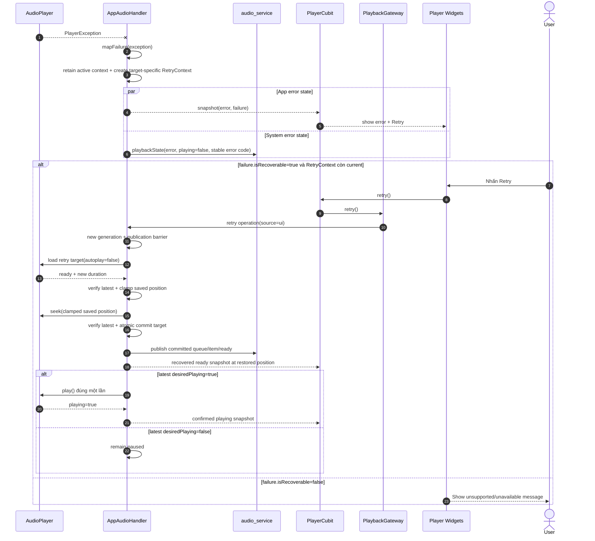

Behavior contract:

- Runtime error giữ active metadata; initial failure không publish metadata;
  replace A → B failure giữ A nhưng Retry nhắm B.
- Retry không publish target ở position zero trước restore.
- Pause trong retry đổi desired intent thành false; Stop/load/navigation mới
  invalidate retry.
- Retry không có recoverable/current context trả typed
  <code>retryUnavailable</code> và không gọi engine.
- Không tạo timer retry vô hạn.

## 19. Sequence Diagram — Hai request load cạnh tranh

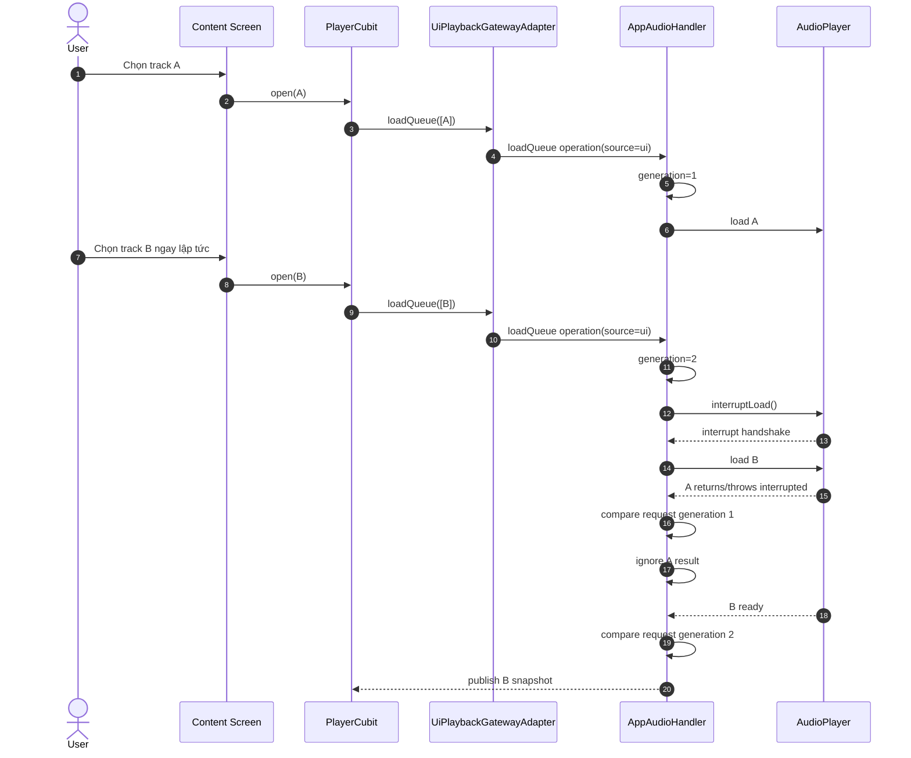

Concurrency contract:

- Latest user intent wins.
- Interrupted error của request cũ không được hiển thị như lỗi của current item.
- Metadata A không được publish sau khi B đã được chọn.

## 20. Sequence Diagram — Stop và cleanup

```mermaid
sequenceDiagram
autonumber
actor Caller as User hoặc System
participant Cubit as PlayerCubit
participant Gateway as UiPlaybackGatewayAdapter
participant Handler as AppAudioHandler
participant Engine as AudioPlayer
participant AS as audio_service
participant OS as System Media Controls
participant Host as PlayerHost

opt Stop đến từ UI
  Caller->>Cubit: stop()
  Cubit->>Gateway: stop()
  Gateway->>Handler: stop operation(source=ui)
end

opt Stop đến từ OS
  Caller->>AS: stop command
  AS->>Handler: stop()
end

Handler->>Handler: enter stopping barrier + increment epoch
Handler->>Handler: invalidate load/retry/navigation/seek cũ
Handler->>Engine: stop()

alt Engine Stop thành công
  Engine-->>Handler: idle / playing=false
  Handler->>Engine: reset speed=1.0, repeat=off, shuffle=false
  Handler->>Handler: atomically replace internal state with canonical idle
  Handler->>AS: mediaItem.add(null)
  Handler->>AS: queue.add(empty)
  Handler->>AS: playbackState(idle, playing=false, controls/actions empty)
  AS-->>OS: remove/deactivate media controls
  Handler-->>Cubit: đúng một idle snapshot
  Cubit-->>Host: currentItem=null
  Host->>Host: remove MiniPlayer + pop player route nếu top-most
else Engine Stop thất bại
  Handler->>Handler: retain active metadata/session + map stopFailed
  Handler->>AS: playbackState(error, latest confirmed playing)
  Handler-->>Cubit: error snapshot; không idle giả
  Cubit-->>Host: keep current route/player
end
```

Behavior contract:

- Stop khác Pause.
- Pause giữ current item/system card.
- Successful Stop clear current item, queue và system card theo đúng publication
  order; engine events trong barrier không tạo snapshot trung gian.
- Stop không dispose handler singleton; app có thể load nội dung mới sau đó.
- Stop lặp sau canonical idle là no-op; Stop thất bại có thể được thử lại.
- Navigation reaction không phát thêm Stop/Pause và không pop route khác.

## 21. Sequence Diagram — Mở/đóng Expanded Player

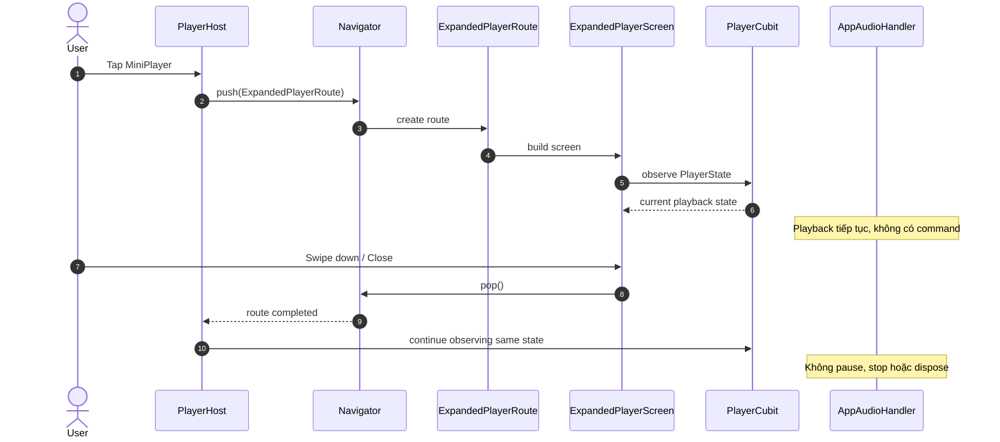

Behavior contract:

- Expanded/minimized là navigation behavior.
- Không có <code>cubit.expand()</code> hoặc <code>cubit.minimize()</code> trong target design.
- Route dispose chỉ dispose sheet/animation controllers của màn hình.

## 22. Sequence Diagram — App background/foreground

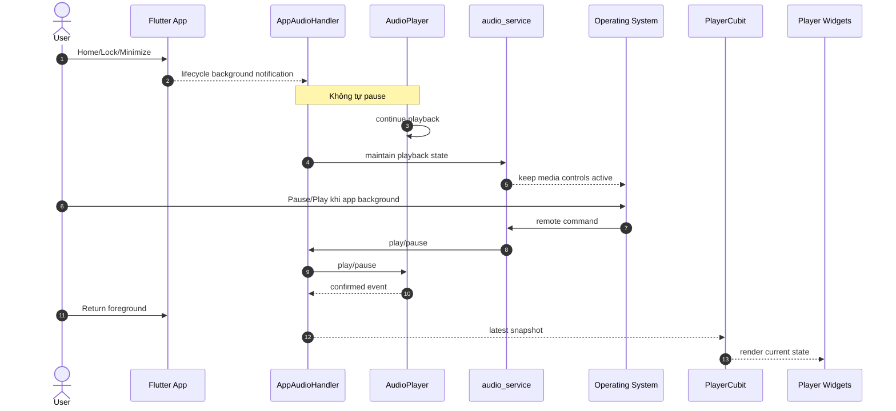

Platform notes:

- Android/iOS: tiếp tục phát khi background/lock theo cấu hình.
- Web: phụ thuộc browser; đóng tab kết thúc.
- macOS: minimize tiếp tục; đóng cửa sổ cuối kết thúc theo scope hiện tại.

## 23. State Machine — Processing lifecycle

<code>processingState</code> mô tả tình trạng decoder/source, không mô tả riêng ý định Play/Pause.

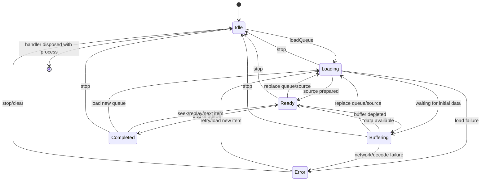

Transition rules:

- <code>Pause</code> không thay processing state nếu engine vẫn ready.
- <code>Play</code> không mặc định chuyển processing state; có thể vẫn buffering.
- <code>Stop</code> đưa processing state về idle.
- <code>Completed</code> giữ current item đến khi replay, load mới hoặc stop.
- Final repeat-off được normalize thành <code>completed × playing=false</code>;
  auto-advance/repeat giữa queue do engine sở hữu.

## 24. State Machine — Play intent

<code>playing</code> là trục độc lập với processing state.

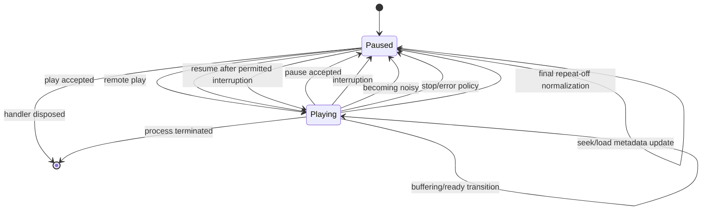

Full runtime state là tích Descartes:

```text
PlaybackState = ProcessingState × PlayIntent

Ví dụ:
ready × playing      → đang phát bình thường
buffering × playing  → đang muốn phát nhưng chờ dữ liệu
ready × paused       → pause và có thể resume ngay
completed × paused   → tới cuối, giữ metadata và hiển thị Replay
error × paused       → lỗi, có thể Retry
```

## 25. State Machine — Media session lifecycle

```mermaid
stateDiagram-v2
[*] --> Inactive

Inactive --> Prepared: AudioService.init
Prepared --> Published: currentItem available
Published --> Playing: playbackState.playing=true
Playing --> Paused: pause/interruption
Paused --> Playing: play/resume

Playing --> Published: final completed normalized paused
Paused --> Published: metadata/state update
Published --> Playing: replay

Playing --> Inactive: stop
Paused --> Inactive: stop
Published --> Inactive: stop/clear item

Inactive --> [*]: process ends
```

System card policy:

| Session state | System card |
|---|---|
| Inactive | Không hiển thị |
| Prepared/Published | Có metadata và controls |
| Playing | Hiển thị playing |
| Paused | Vẫn hiển thị để resume |
| Stop → Inactive | Bị gỡ |

## 26. State Machine — Queue/current item

```mermaid
stateDiagram-v2
[*] --> Empty

Empty --> LoadingQueue: loadQueue
LoadingQueue --> ActiveItem: latest load ready
LoadingQueue --> LoadingQueue: newer load replaces old
LoadingQueue --> Empty: stop/load failure without item

ActiveItem --> ActiveItem: seek/speed/play/pause
ActiveItem --> SwitchingItem: next/previous/index change
SwitchingItem --> ActiveItem: new item ready
SwitchingItem --> ErrorItem: item load error

ActiveItem --> CompletedQueue: last item completed
CompletedQueue --> ActiveItem: replay/repeat/new index
ErrorItem --> LoadingQueue: retry

ActiveItem --> Empty: stop
CompletedQueue --> Empty: stop
ErrorItem --> Empty: stop
```

Active và pending là hai context khác nhau: replace A → B giữ A outward trong
lúc B loading; B chỉ thành ActiveItem sau latest-ready commit. B failure giữ A
metadata nhưng Error/Retry target vẫn là B.

## 27. State Machine — Expanded player route

```mermaid
stateDiagram-v2
[*] --> MiniOnly
MiniOnly --> ExpandedOpening: tap mini
ExpandedOpening --> ExpandedVisible: route animation completed
ExpandedVisible --> TranscriptExpanded: drag transcript sheet up
TranscriptExpanded --> ExpandedVisible: collapse transcript sheet
ExpandedVisible --> ExpandedClosing: close/swipe down
TranscriptExpanded --> ExpandedClosing: close
ExpandedClosing --> MiniOnly: route pop completed
MiniOnly --> Hidden: currentItem becomes null
ExpandedVisible --> Hidden: stop then route closes
Hidden --> MiniOnly: load item
```

Route state và playback state độc lập. Chỉ điều kiện <code>currentItem == null</code> quyết định mini player có tồn tại hay không.

## 28. Activity Diagram — Unified command routing

Mermaid không có cú pháp UML Activity riêng; sơ đồ flowchart dưới đây biểu diễn Activity Diagram.

```mermaid
flowchart TD
    A([Command bắt đầu]) --> B{Nguồn command?}
    B -->|UI| C[Player widget gọi PlayerCubit]
    C --> D[PlayerCubit delegate PlaybackGateway]
    D --> E1[UI adapter gắn source=ui]
    B -->|OS| E[audio_service gọi AudioHandler callback]
    E1 --> F[AppAudioHandler internal operation]
    E --> F
    F --> G{Command hợp lệ với current state?}
    G -->|Typed failure| H[Return PlayerCommandFailure; snapshot không đổi]
    G -->|Idempotent no-op| P
    G -->|Có| I[Điều khiển AudioPlayer]
    I --> J[Chờ engine stream]
    J --> K[Build PlaybackSnapshot]
    K --> L[Emit PlayerCubit state]
    K --> M[Broadcast audio_service state]
    L --> N[UI render]
    M --> O[System controls render]
    H --> P([Kết thúc])
    N --> P
    O --> P
```

Điểm quyết định:

- Có current item không?
- Command có hợp lệ ở queue boundary không?
- Seek target có duration hợp lệ không?
- Request load có còn là latest generation không?
- Matrix PLR-008 quy định execute/no-op/typed failure; diagram không tự chọn.

## 29. Activity Diagram — Load queue

```mermaid
flowchart TD
    A([OpenQueue]) --> B[Validate items và initialIndex]
    B --> C{Input hợp lệ?}
    C -->|Không| D[Emit validation failure]
    C -->|Có| E[Increment loadGeneration]
    E --> F[Emit loading snapshot]
    F --> G[Create pending context; keep active metadata]
    G --> G1[Map PlayerItem sang MediaItem]
    G1 --> H[Map PlayerItem sang AudioSource]
    H --> I[AudioPlayer.setAudioSources]
    I --> J{Load thành công?}
    J -->|Không| K{Interrupted bởi load mới?}
    K -->|Có| L[Ignore stale result]
    K -->|Không| M[Map và emit failure]
    J -->|Có| N{Generation vẫn mới nhất?}
    N -->|Không| L
    N -->|Có| O[Atomic commit active queue + current item]
    O --> P[Emit ready snapshot]
    P --> Q{Autoplay?}
    Q -->|Có| R[AudioPlayer.play]
    Q -->|Không| S([Ready paused])
    R --> T([Ready playing])
    D --> U([Kết thúc])
    L --> U
    M --> U
```

## 30. Activity Diagram — Xử lý engine event

```mermaid
flowchart TD
    A([Engine event]) --> B{Loại event}

    B -->|Player state| C[Map playing + processing state]
    B -->|Position| D[Update position]
    B -->|Buffered position| E[Update bufferedPosition]
    B -->|Duration| F[Update duration]
    B -->|Current index| G[Select current PlayerItem]
    B -->|Speed/loop/shuffle| H[Update playback options]
    B -->|Error| I[Map PlayerFailure]

    C --> J[Build latest PlaybackSnapshot]
    D --> J
    E --> J
    F --> J
    G --> K[Publish MediaItem to audio_service]
    K --> J
    H --> J
    I --> J

    J --> L{Snapshot khác snapshot trước?}
    L -->|Không| M([Bỏ qua duplicate])
    L -->|Có| N[Emit snapshot to Cubit]
    N --> O{OS-relevant fields changed?}
    O -->|Có| P[Broadcast PlaybackState/MediaItem]
    O -->|Không| Q([Kết thúc])
    P --> Q
```

## 31. Activity Diagram — Seek

```mermaid
flowchart TD
    A([Seek request]) --> B{Có current item?}
    B -->|Không| C[Return noCurrentItem]
    B -->|Có| D{Duration đã biết và > 0?}
    D -->|Không| E[Disable/reject seek]
    D -->|Có| F[Clamp target 0..duration]
    F --> G[AudioPlayer.seek]
    G --> H{Engine confirm?}
    H -->|Có| I[Emit confirmed position]
    H -->|Lỗi| J[Map PlayerFailure]
    I --> K[Update OS timeline]
    C --> L([Kết thúc])
    E --> L
    J --> L
    K --> L
```

## 32. Activity Diagram — Error recovery

```mermaid
flowchart TD
    A([Playback error]) --> B[Normalize PlayerFailure]
    B --> C[Retain active context + create target-specific RetryContext]
    C --> D[Emit error snapshot]
    D --> E[Update system playback state]
    E --> F{Recoverable?}
    F -->|Không| G[Show terminal message]
    F -->|Có| H[Show Retry]
    H --> I{User taps Retry?}
    I -->|Không| J([Remain error])
    I -->|Có| K[Start new retry generation + barrier]
    K --> L[Reload retry target autoplay=false]
    L --> M{Ready?}
    M -->|Không| B
    M -->|Có| N[Clamp + seek saved position]
    N --> O[Atomic commit target]
    O --> O1{Latest desiredPlaying?}
    O1 -->|Có| O2[Play exactly once]
    O1 -->|Không| P([Recovered paused])
    O2 --> P1([Recovered playing after engine confirm])
    G --> Q([Kết thúc])
```

## 33. Activity Diagram — Stop

```mermaid
flowchart TD
    A([Stop]) --> B[Enter publication barrier + increment epoch]
    B --> C[Invalidate load/retry/navigation/seek]
    C --> D[AudioPlayer.stop]
    D --> E{Stop thành công?}
    E -->|Không| F[Retain active session + emit stopFailed]
    F --> G([Không pop route; cho phép retry Stop])
    E -->|Có| H[Reset engine options to baseline]
    H --> I[Atomically install canonical idle]
    I --> J[Publish null media item]
    J --> K[Publish empty queue]
    K --> L[Publish OS idle + remove card]
    L --> M[Emit exactly one idle snapshot]
    M --> N[Remove MiniPlayer + guarded route pop]
    N --> O([Handler remains reusable])
```

## 34. Concurrency và Ordering Contracts

### 34.1. Latest load wins

Mỗi <code>loadQueue</code> nhận một generation tăng dần. Result chỉ được commit nếu generation của request bằng generation hiện tại.

### 34.2. Command serialization

Các command thay source/queue cần được serialize:

- loadQueue.
- stop trong khi loading.
- retry.
- next/previous trong khi switching item.

Play/Pause/Seek không được giữ lock dài hơn platform call cần thiết.

### 34.3. State ordering

Thứ tự tối thiểu khi load thành công:

```text
loading
→ queue/current item published
→ ready
→ playing nếu autoplay
```

Thứ tự khi Stop:

```text
stopping barrier + epoch invalidated
→ engine stopped
→ engine options reset
→ internal canonical idle installed atomically
→ media item cleared
→ queue cleared
→ OS playback idle/system card removed
→ exactly one Cubit idle snapshot
```

### 34.4. Duplicate suppression

Không emit snapshot mới nếu tất cả fields có ý nghĩa đều giống snapshot trước.

Không publish lại:

- Artwork trên mỗi position tick.
- Queue trên mỗi play/pause.
- MediaItem trên mỗi buffering event.

## 35. Timing và Performance Contracts

| Hành vi | Mục tiêu |
|---|---|
| UI position update | Khoảng 200 ms |
| OS position-only resync | Khoảng 1 giây |
| Remote Play/Pause phản ánh lên UI | Dưới khoảng 500 ms |
| Seek commit | Một platform call cho mỗi drag |
| Metadata publication | Khi current item/metadata đổi |
| Queue publication | Khi queue/order đổi |
| Artwork rebuild | Không theo position |
| Transcript active cue | Derived từ position, chỉ rebuild vùng cue |
| System timeline | Dùng updatePosition/updateTime/speed để nội suy; seek/play/pause/item/speed/error/Stop publish ngay |

Nếu platform stream phát event dày hơn UI cần, throttle ở projection stream hoặc selector; không làm mất event lifecycle quan trọng.

## 36. Platform Behavior Matrix

| Hành vi | Android | iOS | Web | macOS |
|---|---|---|---|---|
| Background playback | Có | Có | Best effort | Có khi process sống |
| Lock/system controls | Media controls | Now Playing | Media Session tùy browser | Control Center |
| Remote Play/Pause | Có | Có | Tùy browser | Có |
| Seek | Có | Có | Tùy browser | Có |
| Headset/media keys | Có | Có | Tùy browser/device | Có |
| Audio interruption | Audio focus | AVAudioSession | Browser policy | Hạn chế theo OS |
| Đóng app/tab/window | Theo service policy | Process kết thúc | Tab đóng là kết thúc | Cửa sổ cuối đóng là kết thúc trong scope hiện tại |

Behavior fallback:

- Web không có Media Session: UI player vẫn hoạt động.
- Browser chặn autoplay: hiển thị Play và chờ user gesture.
- Artwork OS load lỗi: playback vẫn tiếp tục với metadata text.
- Không có duration: disable scrubber, vẫn cho Play/Pause.

## 37. Observable Logging Events

Các event nên log có cấu trúc để debug hành vi:

| Event name | Fields chính |
|---|---|
| <code>player_load_started</code> | itemId, generation, index |
| <code>player_load_ready</code> | itemId, duration, latency |
| <code>player_play</code> | itemId, position, source |
| <code>player_pause</code> | itemId, position, source |
| <code>player_seek</code> | from, to, source |
| <code>player_item_changed</code> | oldItemId, newItemId, reason |
| <code>player_buffering_started</code> | itemId, position |
| <code>player_buffering_ended</code> | itemId, durationMs |
| <code>player_interrupted</code> | type, position |
| <code>player_error</code> | code, itemId, recoverable |
| <code>player_stopped</code> | itemId, reason |

<code>source</code> canonical:

- ui.
- systemRemote.
- interruption.

Chỉ dùng `lock_screen`, `notification`, `headset`, `control_center` hoặc
`web_media_session` khi callback thực sự cung cấp provenance đó; không suy đoán
từ loại command. Logging không được làm thay đổi command path hoặc trở thành
dependency bắt buộc của playback.

## 38. Behavioral Test Scenarios

### 38.1. UI Play/Pause

```gherkin
Given một item đã ready và đang paused
When người dùng nhấn Play
Then Cubit delegate play đúng một lần
And UI chưa đổi trước engine confirmation
And engine emit playing
And UI cùng system controls chuyển sang playing
```

### 38.2. Remote Pause

```gherkin
Given app đang background và audio đang phát
When người dùng nhấn Pause trên lock screen
Then audio_service gọi AppAudioHandler.pause
And AudioPlayer pause
And khi app foreground trở lại UI hiển thị paused
```

### 38.3. Buffering

```gherkin
Given playing=true và processingState=ready
When engine chuyển sang buffering
Then playing vẫn true
And UI hiện buffering
And nút chính vẫn thể hiện Pause intent
When engine trở lại ready
Then UI bỏ buffering mà không gọi play lần nữa
```

### 38.4. Seek drag

```gherkin
Given track có duration hợp lệ
When người dùng kéo slider qua nhiều vị trí
Then UI cập nhật local preview
And gateway chưa nhận seek
When người dùng thả slider
Then gateway nhận đúng một seek với position cuối
```

### 38.5. Latest load wins

```gherkin
Given load A đang chạy
When load B bắt đầu trước khi A hoàn tất
And A hoàn tất sau B
Then current item vẫn là B
And metadata A không được publish
And interrupted result A không trở thành UI error
```

### 38.6. Stop

```gherkin
Given một item đang phát
When Stop được gọi
Then engine dừng
And current item và queue được clear
And system media controls biến mất
And mini player biến mất
And handler vẫn có thể load item mới
```

### 38.7. Completion và Replay

```gherkin
Given engine sequence đang phát item không phải cuối
When item hoàn tất
Then engine tự chuyển item đúng một lần
And handler không gọi manual next hoặc seek

Given item cuối completed và repeat off
When handler nhận engine completion
Then handler normalize đúng một lần thành completed và playing=false
And metadata/current item vẫn còn
When người dùng chọn Replay
Then engine nhận seek zero trước Play, mỗi call đúng một lần
```

### 38.8. Retry pending target

```gherkin
Given A đang active và replace B thất bại
Then metadata outward vẫn là A
And failure và RetryContext target là B
When Retry thành công
Then B được seek restore trước khi commit metadata
And Pause trong lúc Retry ngăn Play sau commit
```

## 39. Traceability Matrix

| Behavior | Sequence | State Machine | Activity | Class chịu trách nhiệm |
|---|---:|---:|---:|---|
| Bootstrap | 5 | 25 | — | main, AudioService, AppAudioHandler, engine, UI adapter |
| Load/autoplay | 6 | 23, 26 | 29 | PlayerCubit, UI adapter, Handler, engine |
| UI Play/Pause | 7 | 24 | 28 | PlayerCubit, UI adapter, Handler, engine |
| Remote Play/Pause | 8 | 24, 25 | 28 | audio_service, AppAudioHandler |
| Position sync | 9 | 23, 24 | 30 | PlaybackEngine, AppAudioHandler, UI adapter |
| Slider seek | 10 | 23 | 31 | PlayerControlDock, Handler |
| Remote seek | 11 | 23 | 31 | audio_service, Handler |
| Skip ±10s | 12 | 23 | 31 | Handler |
| Next/Previous | 13 | 26 | 28 | Handler |
| Buffering | 14 | 23 | 30 | AudioPlayer, Handler |
| Completion | 15 | 23, 24, 26 | 30 | AudioPlayer + Handler end normalizer |
| Interruption | 16 | 24 | 30 | AudioSession, AudioPlayer |
| Becoming noisy | 17 | 24 | 30 | AudioSession, AudioPlayer |
| Error/Retry | 18 | 23, 26 | 32 | Handler, PlayerCubit |
| Load race | 19 | 26 | 29 | Handler |
| Stop | 20 | 23, 25, 26 | 33 | Handler |
| Expanded route | 21 | 27 | — | Navigator, PlayerHost |
| Background | 22 | 25 | 28 | audio_service, Handler |

## 40. Behavioral Review Checklist

- [ ] UI command và OS command hội tụ vào cùng handler operation.
- [ ] UI không đổi playing trước engine event.
- [ ] Buffering và playing được biểu diễn độc lập.
- [ ] Position đến từ engine stream.
- [ ] Slider chỉ seek khi drag kết thúc.
- [ ] Metadata không publish theo position tick.
- [ ] Remote command hoạt động khi UI background.
- [ ] Current snapshot khôi phục UI khi app foreground.
- [ ] Latest load wins.
- [ ] Stale load result không tạo UI error.
- [ ] Repeat one/all/off có behavior được kiểm thử.
- [ ] Previous policy dùng một constant chung.
- [ ] Completed giữ metadata và cho phép Replay.
- [ ] Final completed được normalize thành playing=false đúng một lần.
- [ ] Retry restore trước commit và retry đúng pending target.
- [ ] Pause giữ system card.
- [ ] Stop clear system card, queue và mini player.
- [ ] Interruption chỉ có một owner.
- [ ] Becoming noisy luôn Pause và không auto-resume.
- [ ] Route push/pop không gửi playback command.
- [ ] Handler không dispose khi expanded route dispose.
- [ ] Web có graceful fallback khi không có Media Session.

## 41. Kết luận

Cấu trúc động mục tiêu được rút gọn thành hai phương trình:

```text
Command path:
UI Intent → PlayerCubit → PlaybackGateway/UI adapter
OS Intent → BaseAudioHandler callback
→ cùng AppAudioHandler internal operation
→ AudioPlayer
```

```text
State path:
AudioPlayer Event
→ AppAudioHandler
→ (PlaybackGateway snapshot ∪ audio_service.PlaybackState)
→ (PlayerCubit/UI ∪ System Media Controls)
```

Sequence Diagram bảo đảm thứ tự message rõ ràng. State Machine Diagram bảo đảm mọi chuyển trạng thái hợp lệ. Activity Diagram bảo đảm các nhánh validation, race, error và cleanup có một đường xử lý duy nhất.
