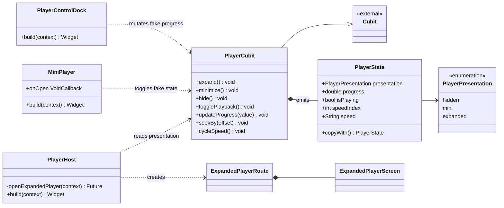
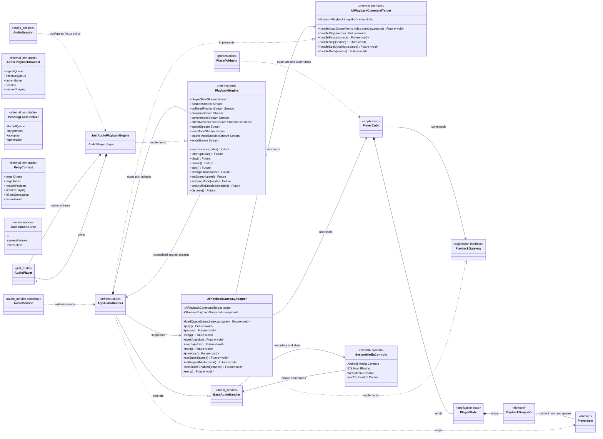
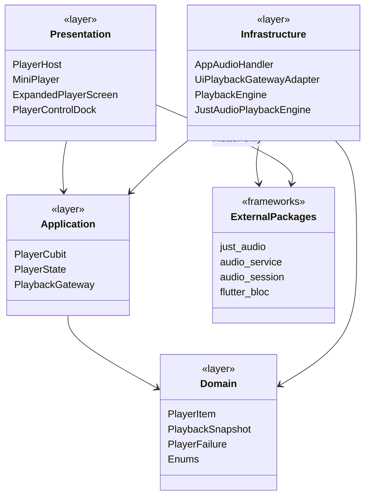
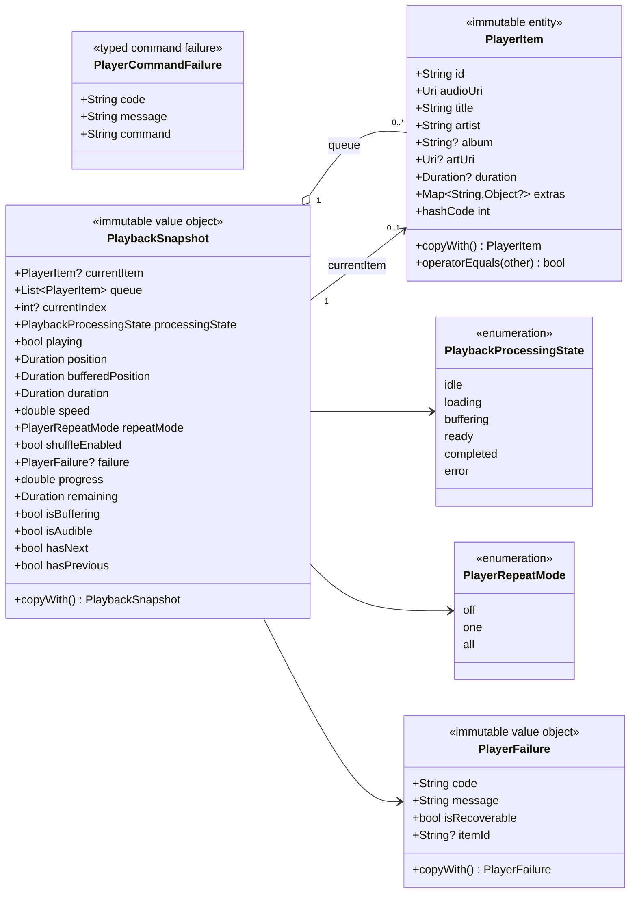
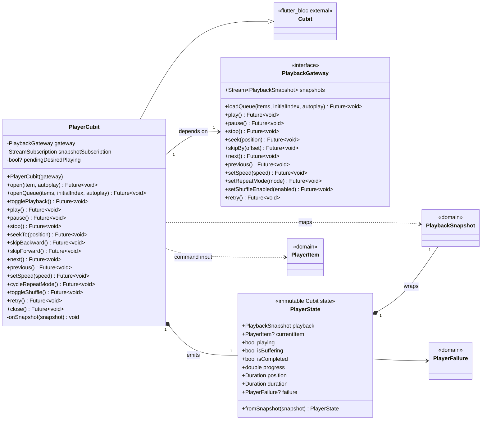
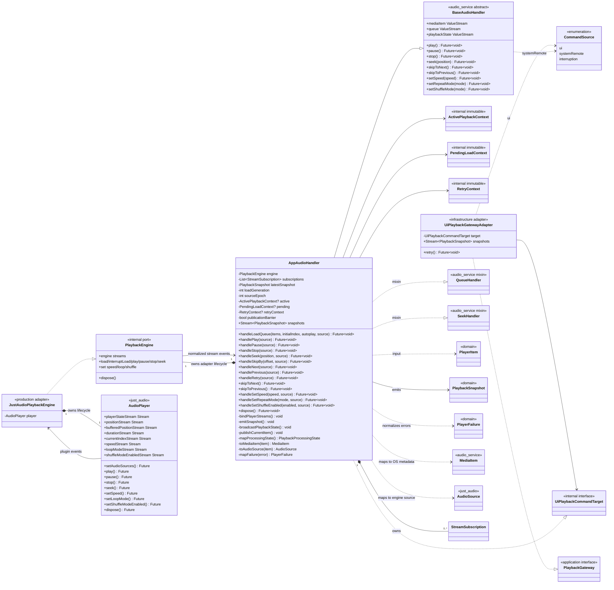
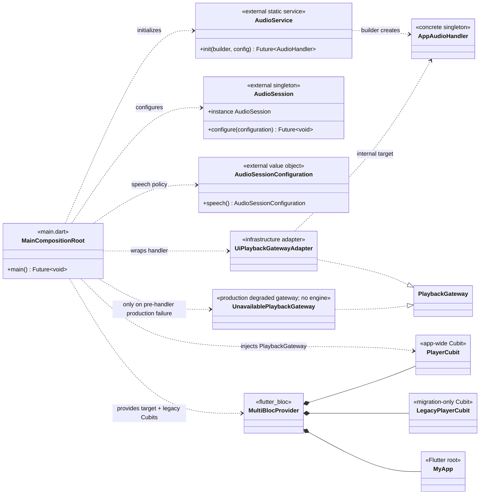
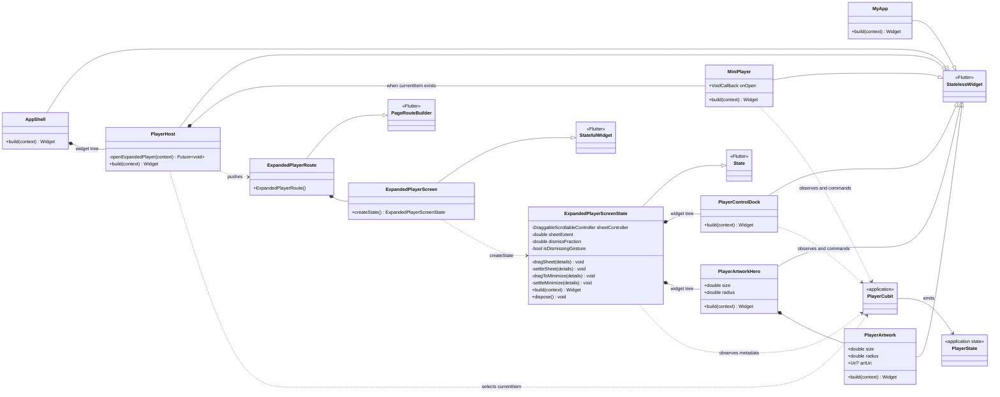
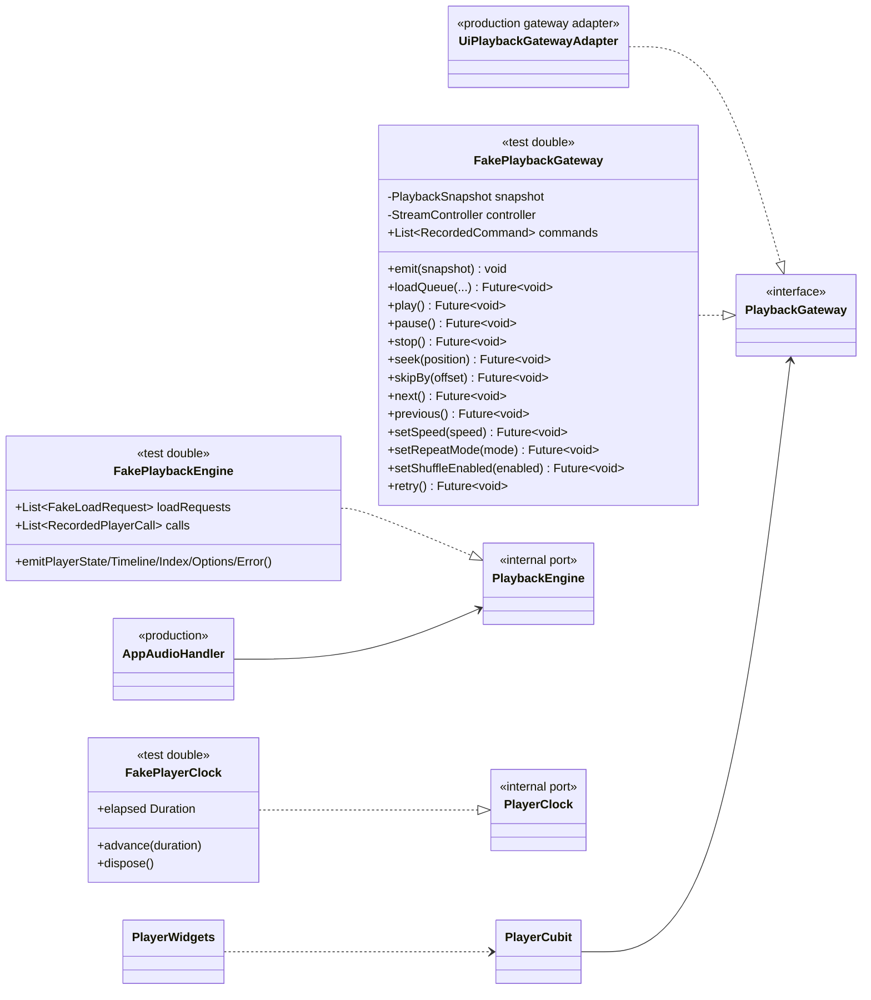

# Player Architecture — Class Diagram

> Loại tài liệu: Thiết kế hướng đối tượng (OOP)<br>
> Trạng thái: Target design, chưa phải hiện trạng đã implement<br>
> Phạm vi: Android, iOS, Web và macOS<br>
> Stack: <code>just_audio + audio_service + audio_session + flutter_bloc</code><br>
> Cập nhật: 2026-08-02<br>
> Contract normative: [Player Architecture Decisions](./player-architecture-decisions.md)<br>
> Tài liệu liên quan: [Kế hoạch triển khai Player](./player-implementation-plan.md)

## 1. Mục đích tài liệu

Tài liệu này mô tả thiết kế lớp cho player toàn ứng dụng, bao gồm:

- Tên và trách nhiệm của từng lớp.
- Thuộc tính mà lớp sở hữu.
- Phương thức công khai và phương thức nội bộ quan trọng.
- Quan hệ kế thừa, hiện thực interface, phụ thuộc, kết tập và hợp thành.
- Ranh giới giữa Domain, Application, Infrastructure và Presentation.
- Luồng command từ UI hoặc hệ điều hành tới audio engine.
- Luồng state từ audio engine trở lại Cubit, UI và system media controls.

Thiết kế tuân theo nguyên tắc:

```text
Một AudioPlayer
+ Một AppAudioHandler
+ Một PlayerCubit toàn app
= Một nguồn sự thật cho mọi giao diện và system controls
```

## 2. Cách đọc Class Diagram

Một lớp trong sơ đồ có ba vùng:

```text
┌─────────────────────────────┐
│ Class Name                  │
├─────────────────────────────┤
│ Attributes                  │
├─────────────────────────────┤
│ Methods / Operations        │
└─────────────────────────────┘
```

Quy ước visibility:

| Ký hiệu | Ý nghĩa |
|---|---|
| <code>+</code> | Public |
| <code>-</code> | Private |
| <code>#</code> | Protected |
| <code>~</code> | Package/internal |

Quy ước quan hệ Mermaid/UML:

| Cú pháp | Quan hệ | Ý nghĩa trong thiết kế |
|---|---|---|
| <code>A --\|> B</code> | Generalization | A kế thừa B |
| <code>A ..\|> B</code> | Realization | A implement interface hoặc áp dụng contract B |
| <code>A *-- B</code> | Composition | A sở hữu vòng đời B; A mất thì B cũng mất |
| <code>A o-- B</code> | Aggregation | A chứa/tham chiếu B nhưng B có thể tồn tại độc lập |
| <code>A --> B</code> | Association | A giữ liên kết ổn định tới B |
| <code>A ..> B</code> | Dependency | A chỉ dùng B trong một hành vi hoặc tại thời điểm chạy |

## 3. Hiện trạng trước khi triển khai

Sơ đồ dưới đây mô tả code hiện tại. Player mới chỉ là UI state mô phỏng, chưa có audio engine hoặc media session.



Vấn đề thể hiện trên sơ đồ:

- <code>PlayerCubit</code> vừa giữ playback state giả vừa giữ navigation state.
- Không có <code>AudioPlayer</code>.
- Không có <code>AudioHandler</code>.
- Không có metadata model dùng chung.
- Không có stream position/buffering/error.
- System controls không có điểm kết nối.
- UI tự thay đổi <code>isPlaying</code> và <code>progress</code>, vì vậy không thể đồng bộ với lock screen.

Source hiện tại:

- [player_cubit.dart](../lib/features/player/presentation/cubit/player_cubit.dart)
- [player_host.dart](../lib/features/player/presentation/widgets/player_host.dart)
- [mini_player.dart](../lib/features/player/presentation/widgets/mini_player.dart)
- [player_control_dock.dart](../lib/features/player/presentation/widgets/player_control_dock.dart)

## 4. Target Class Diagram — Tổng thể



### 4.1. Ý nghĩa luồng tổng thể

Luồng UI:

```text
PlayerWidgets
→ PlayerCubit
→ PlaybackGateway
→ UiPlaybackGatewayAdapter(source=ui)
→ UiPlaybackCommandTarget/AppAudioHandler
→ PlaybackEngine/JustAudioPlaybackEngine
→ AudioPlayer
```

Luồng system control:

```text
Lock screen / Notification / Headset
→ audio_service.BaseAudioHandler callbacks
→ AppAudioHandler
→ PlaybackEngine/JustAudioPlaybackEngine
→ AudioPlayer
```

Luồng state:

```text
AudioPlayer streams
→ JustAudioPlaybackEngine/PlaybackEngine
→ AppAudioHandler
→ PlaybackSnapshot
→ UiPlaybackGatewayAdapter
→ PlayerCubit
→ PlayerState
→ PlayerWidgets
```

Luồng system state:

```text
AudioPlayer streams
→ AppAudioHandler
→ BaseAudioHandler.playbackState / mediaItem / queue
→ Android / iOS / Web / macOS
```

## 5. Layer Dependency Diagram



Dependency rules:

1. Domain không import Flutter, Bloc, just_audio hoặc audio_service.
2. Presentation không import just_audio hoặc audio_service.
3. PlayerCubit chỉ biết <code>PlaybackGateway</code>, không biết <code>AudioPlayer</code>.
4. Infrastructure được phép import package ngoài và map về domain model.
5. Composition root là nơi biết concrete handler, production engine và UI adapter.
6. <code>AppAudioHandler</code> không implement public <code>PlaybackGateway</code>;
   adapter giữ dependency direction và command provenance.

## 6. Domain Layer — Class Diagram



### 6.1. PlayerItem

Trách nhiệm:

- Đại diện cho một nội dung có thể phát.
- Là metadata duy nhất dùng bởi UI và system controls.
- Không chứa logic của plugin.

Attributes:

| Attribute | Type | Bắt buộc | Ý nghĩa |
|---|---|---|---|
| <code>id</code> | String | Có | Content ID ổn định |
| <code>audioUri</code> | Uri | Có | URL/file/asset thực tế để phát |
| <code>title</code> | String | Có | Tên nội dung |
| <code>artist</code> | String | Có | Tác giả/kênh |
| <code>album</code> | String? | Không | Course/series/album |
| <code>artUri</code> | Uri? | Không | Artwork cho UI và Now Playing |
| <code>duration</code> | Duration? | Không | Duration dự kiến từ API; engine có thể cập nhật |
| <code>extras</code> | Map&lt;String, Object?&gt; | Không | Deep-immutable graph theo PLR-001 |

Methods:

- <code>copyWith()</code>: tạo immutable copy.
- Value equality: giúp Cubit/selector tránh rebuild không cần thiết.
- Constructor/copyWith deep-copy và recursively unmodifiable list/map.
- Allowed values: null, bool, int, finite double, String, Uri, Duration,
  List&lt;Object?&gt; và Map&lt;String, Object?&gt;; reject cyclic/arbitrary values.
- <code>audioUri</code>: https/asset trên mọi target; file chỉ native;
  http/unknown reject.
- <code>artUri</code>: https trên mọi target; file chỉ native;
  asset/http/unknown reject.

Không đặt <code>toMediaItem()</code> trong lớp này vì như vậy Domain sẽ phụ thuộc
<code>audio_service</code>. Việc mapping thuộc Infrastructure mapper.

### 6.2. PlaybackSnapshot

Trách nhiệm:

- Chụp trạng thái playback thật tại một thời điểm.
- Là contract state mà Infrastructure gửi cho Application.
- Cho phép Cubit và tests không biết API của just_audio.

Không tự chạy timer. <code>position</code> phải đến từ engine stream.

### 6.3. PlayerFailure

Trách nhiệm:

- Chuẩn hóa lỗi package/platform về lỗi domain.
- Cho UI biết lỗi có retry được hay không.

`PlayerCommandFailure` tách invalid command/programmer input khỏi engine
`PlayerFailure`. Typed command failure không được ghi vào playback snapshot.
- Không đưa exception object hoặc stack trace vào persistent state.

Ví dụ code:

| Code | Recoverable | Ý nghĩa |
|---|---|---|
| <code>network</code> | Có | Mất mạng hoặc server timeout |
| <code>not_found</code> | Có thể | Audio URL không còn tồn tại |
| <code>unsupported_format</code> | Không | Codec/source không hỗ trợ |
| <code>audio_output</code> | Có thể | Không khởi tạo được thiết bị phát |
| <code>interrupted_load</code> | Có | Request cũ bị request mới thay thế |

## 7. Application Layer — Class Diagram



### 7.1. PlaybackGateway

Đây là Dependency Inversion boundary:

- PlayerCubit phụ thuộc interface.
- UiPlaybackGatewayAdapter implement interface và forward vào internal handler target.
- Tests cung cấp FakePlaybackGateway.
- Presentation không biết implementation được dùng là just_audio.

Contract rules:

- Methods trả <code>Future</code> để caller có thể nhận lỗi command.
- State chính thức chỉ đi qua <code>snapshots</code>.
- Command không được yêu cầu Cubit tự đoán kết quả.
- <code>loadQueue</code> là entry point duy nhất thay queue.
- <code>retry()</code> là first-class atomic command; Cubit không ghép load/seek/play.
- Invalid command hoàn tất bằng typed <code>PlayerCommandFailure</code> và không
  tạo playback snapshot giả.

### 7.2. PlayerState

<code>PlayerState</code> là UI projection, không phải engine state thứ hai.

Nó giữ một <code>PlaybackSnapshot</code> và cung cấp getters thuận tiện để UI không phải truy cập sâu:

```text
state.currentItem
state.playing
state.progress
state.position
state.duration
state.failure
```

Không copy toàn bộ playback fields thành các biến có thể thay đổi độc lập. Nếu implementation chọn flatten fields để tiện sử dụng, factory <code>fromSnapshot</code> phải là đường tạo state duy nhất.

### 7.3. PlayerCubit

Trách nhiệm:

- Nhận intent từ UI.
- Delegate command sang gateway.
- Subscribe snapshot.
- Emit immutable PlayerState.
- Hủy subscription khi close.
- Giữ private pending desired playing chỉ để route rapid Toggle; không expose
  thành PlayerState và clear/reconcile khi có confirmed snapshot/failure.

Không thuộc trách nhiệm:

- Sở hữu AudioPlayer.
- Tạo timer position.
- Gọi MediaSession API.
- Tải artwork cho hệ điều hành.
- Xử lý Android/iOS lifecycle trực tiếp.
- Quản lý expanded/minimized route.

## 8. Infrastructure Layer — Class Diagram



### 8.1. Composition với AudioPlayer

Quan hệ:

```text
AppAudioHandler "1" *-- "1" PlaybackEngine
JustAudioPlaybackEngine "1" *-- "1" AudioPlayer
```

Đây là composition vì:

- Handler production factory tạo đúng một `JustAudioPlaybackEngine` qua port.
- Production engine adapter là object duy nhất tạo/điều khiển AudioPlayer.
- Handler dispose engine adapter; adapter dispose AudioPlayer đúng một lần.
- Widget/Cubit không được giữ reference tới AudioPlayer.

### 8.2. Hai interface command hội tụ

<code>AppAudioHandler</code> nhận hai loại command:

1. Application commands qua
   <code>PlaybackGateway → UiPlaybackGatewayAdapter → UiPlaybackCommandTarget</code>.
2. System commands qua các override của <code>BaseAudioHandler</code>.

Cả hai phải hội tụ vào cùng private operation:

```text
PlayerCubit.next()
→ PlaybackGateway.next()
→ UiPlaybackGatewayAdapter(source=ui)
→ AppAudioHandler internal next operation
→ PlaybackEngine.seek(nextIndex)

Lock screen next
→ BaseAudioHandler.skipToNext()
→ AppAudioHandler internal next operation(source=systemRemote)
→ PlaybackEngine.seek(nextIndex)
```

Không được copy hai implementation điều hướng queue khác nhau.

### 8.3. Mapping PlayerItem

```text
PlayerItem
 ├─→ audio_service.MediaItem
 │    ├─ id
 │    ├─ title
 │    ├─ artist
 │    ├─ album
 │    ├─ artUri
 │    ├─ duration
 │    └─ extras.audioUri
 │
 └─→ just_audio.AudioSource
      └─ Uri(audioUri)
```

Infrastructure mappers được handler dùng là nơi duy nhất thực hiện hai mapping
này, bảo đảm UI và OS không dùng metadata khác nhau.

### 8.4. Playback state broadcasting

Engine streams được gom thành hai output:

1. <code>PlaybackSnapshot</code> qua UI Gateway adapter cho Cubit.
2. <code>audio_service.PlaybackState</code> cho OS.

Fields cần broadcast cho OS:

- Controls hiện có.
- System actions.
- Processing state.
- Playing.
- Update position.
- Buffered position.
- Speed.
- Queue index.
- Repeat mode.
- Shuffle mode.

Không broadcast metadata lại trên mỗi position tick. Metadata chỉ thay khi current item hoặc metadata thật thay đổi.

- UI position projection có cadence 200 ms.
- OS position-only resync có cadence 1 giây.
- Item/play/pause/seek/speed/buffering/completed/error/Stop publish ngay.

### 8.5. Race protection

<code>loadGeneration</code> bảo vệ trường hợp người dùng chọn nhiều track liên tục:

```text
load A starts  → generation 1
load B starts  → generation 2
load A returns → ignored because 1 != 2
load B returns → accepted
```

Chỉ request mới nhất được publish current item/queue. Handler giữ riêng:

- `ActivePlaybackContext`: state đã commit và được phép publish.
- `PendingLoadContext`: target đang load, chưa được masquerade thành active.
- `RetryContext`: exact failed target/index/restore position/desired intent.
- `sourceEpoch` + publication barrier: chặn Stop/retry/load event cũ tạo outward
  tuple không nhất quán.

## 9. Bootstrap và External Services



Bootstrap order:

```text
WidgetsFlutterBinding.ensureInitialized()
→ AudioService.init(AppAudioHandler)
→ AudioSession.configure(speech)
→ UiPlaybackGatewayAdapter(AppAudioHandler)
→ PlayerCubit(PlaybackGateway)
→ MultiBlocProvider(PlayerCubit + LegacyPlayerCubit)
→ runApp(MyApp)
```

Object cardinality trong một app process:

| Class | Số lượng |
|---|---:|
| AppAudioHandler | 1 |
| UiPlaybackGatewayAdapter | 1 |
| JustAudioPlaybackEngine | 1 |
| AudioPlayer | 1 |
| PlayerCubit | 1 |
| AudioSession | 1 shared instance |
| MiniPlayer widget instances | 0 hoặc 1 trên active shell |
| ExpandedPlayerScreen route | 0 hoặc 1 |

## 10. Presentation Layer — Class Diagram



### 10.1. PlayerHost

Trách nhiệm:

- Hiển thị mini player khi <code>state.currentItem != null</code>.
- Push expanded route khi người dùng mở player.
- Không thay playback state khi route push/pop.

Không còn:

- <code>cubit.expand()</code>.
- <code>cubit.minimize()</code>.
- Kiểm tra <code>PlayerPresentation</code>.

### 10.2. MiniPlayer

Attributes:

- <code>onOpen</code>: callback mở expanded route.

Dependencies:

- Chỉ đọc các state slice: current item, playing, buffering, progress.
- Gọi <code>PlayerCubit.togglePlayback()</code>.

Không:

- Chứa metadata hard-code.
- Sở hữu AudioPlayer.
- Tự thay progress.

### 10.3. ExpandedPlayerScreen

Trách nhiệm:

- Quản lý gesture, sheet và route presentation.
- Render metadata/state từ PlayerCubit.
- Không quyết định background lifecycle.

State cục bộ hợp lệ:

- Sheet extent.
- Dismiss gesture fraction.
- Local seek preview trong thời gian người dùng drag.

State không được giữ cục bộ:

- Playing.
- Current item.
- Queue.
- Duration chính thức.
- Speed/repeat/shuffle chính thức.

### 10.4. PlayerControlDock

Command mapping:

| UI control | PlayerCubit method |
|---|---|
| Play/Pause | <code>togglePlayback()</code> |
| Rewind 10s | <code>skipBackward()</code> |
| Forward 10s | <code>skipForward()</code> |
| Slider commit | <code>seekTo(position)</code> |
| Speed | <code>setSpeed(speed)</code> |
| Repeat | <code>cycleRepeatMode()</code> |
| Shuffle | <code>toggleShuffle()</code> |
| Next | <code>next()</code> |
| Previous | <code>previous()</code> |

## 11. Command Collaboration Matrix

| Use case | Caller | Application method | Handler method | Engine method |
|---|---|---|---|---|
| Play từ UI | Mini/Dock | <code>cubit.play()</code> | <code>handler.play()</code> | <code>player.play()</code> |
| Pause từ UI | Mini/Dock | <code>cubit.pause()</code> | <code>handler.pause()</code> | <code>player.pause()</code> |
| Toggle | Mini/Dock | <code>togglePlayback()</code> | play hoặc pause | play hoặc pause |
| Seek | Dock | <code>seekTo(position)</code> | <code>seek(position)</code> | <code>seek(position)</code> |
| Tua lùi | Dock | <code>skipBackward()</code> | <code>skipBy(-10s)</code> | <code>seek(clamped)</code> |
| Tua tới | Dock | <code>skipForward()</code> | <code>skipBy(+10s)</code> | <code>seek(clamped)</code> |
| Next | UI | <code>next()</code> | <code>skipToNext()</code> | seek next index |
| Previous | UI | <code>previous()</code> | <code>skipToPrevious()</code> | seek previous index |
| Speed | UI | <code>setSpeed()</code> | <code>setSpeed()</code> | <code>setSpeed()</code> |
| Stop | UI | <code>stop()</code> | <code>stop()</code> | <code>stop()</code> |
| Play từ OS | audio_service | Không qua Cubit | <code>play()</code> override | <code>play()</code> |
| Seek từ OS | audio_service | Không qua Cubit | <code>seek()</code> override | <code>seek()</code> |
| Next từ OS | audio_service | Không qua Cubit | <code>skipToNext()</code> | seek next index |

Điểm quan trọng: OS commands không đi vòng qua Cubit vì khi Android đánh thức background service, UI/Cubit có thể chưa tồn tại. Cubit nhận kết quả qua snapshot sau khi engine đổi trạng thái.

## 12. State Ownership Matrix

| State | Owner duy nhất | Consumers |
|---|---|---|
| Current audio source | PlaybackEngine confirmed + AppAudioHandler active context | Cubit, OS |
| Playing | AudioPlayer | Handler, Cubit, OS |
| Processing state | AudioPlayer | Handler, Cubit, OS |
| Position | AudioPlayer | Handler, Cubit, seek UI, OS |
| Buffered position | AudioPlayer | Handler, Cubit, OS |
| Duration | AudioPlayer/current item | Handler, Cubit, OS |
| Logical queue | AppAudioHandler active context | Shuffle mapper/engine |
| Effective queue/index | PlaybackEngine confirmed + AppAudioHandler synchronized | Cubit, OS |
| Pending load target | AppAudioHandler pending context | Retry/failure mapper only |
| Retry target/intent | AppAudioHandler RetryContext/coordinator | Handler only |
| Speed | AudioPlayer | Cubit, OS |
| Repeat/shuffle | AudioPlayer | Cubit, OS |
| Failure | AppAudioHandler normalized from engine | Cubit, UI |
| Expanded route | Navigator | PlayerHost/route |
| Sheet/dismiss gesture | ExpandedPlayerScreenState | Expanded UI |
| Seek drag preview | PlayerControlDock local state | Slider only |

Không có một state nào đồng thời có hai owner độc lập.

## 13. Relationship Decisions

### 13.1. PlayerCubit phụ thuộc PlaybackGateway

```text
PlayerCubit --> PlaybackGateway
```

Đây là association/dependency ổn định vì Cubit giữ gateway trong suốt vòng đời.

Lợi ích:

- Test không cần plugin.
- Có thể thay engine mà không sửa UI.
- Không để plugin type tràn sang Presentation.

### 13.2. UiPlaybackGatewayAdapter hiện thực PlaybackGateway

```text
UiPlaybackGatewayAdapter ..|> PlaybackGateway
UiPlaybackGatewayAdapter --> UiPlaybackCommandTarget
AppAudioHandler ..|> UiPlaybackCommandTarget
```

Adapter là realization của Application contract và gắn `CommandSource.ui`.
Handler chỉ hiện thực internal target để OS override và UI adapter hội tụ cùng
operation mà không làm Application phụ thuộc concrete BaseAudioHandler.

### 13.3. AppAudioHandler kế thừa BaseAudioHandler

```text
AppAudioHandler --|> BaseAudioHandler
```

Đây là inheritance bắt buộc bởi <code>audio_service</code>. Các override trở thành entry point cho lock screen, notification, headset và Control Center.

### 13.4. Handler hợp thành engine port adapter

```text
AppAudioHandler *-- PlaybackEngine
JustAudioPlaybackEngine ..|> PlaybackEngine
JustAudioPlaybackEngine *-- AudioPlayer
```

Composition bảo đảm production có đúng một AudioPlayer và test inject được fake
engine không platform channel.

### 13.5. PlaybackSnapshot kết tập PlayerItem

```text
PlaybackSnapshot o-- PlayerItem
```

Đây là aggregation vì PlayerItem có thể tồn tại trước/sau snapshot, ví dụ đến từ catalog hoặc API.

### 13.6. Presentation phụ thuộc PlayerCubit

```text
MiniPlayer ..> PlayerCubit
PlayerControlDock ..> PlayerCubit
ExpandedPlayerScreenState ..> PlayerCubit
```

Đây là dependency qua <code>BuildContext</code>/<code>BlocProvider</code>. Widget không sở hữu vòng đời Cubit.

## 14. Lifecycle Diagram của các object chính

```mermaid
stateDiagram-v2
[*] --> Bootstrap
Bootstrap --> HandlerReady: AudioService.init
HandlerReady --> GatewayReady: UiPlaybackGatewayAdapter(handler)
GatewayReady --> CubitReady: PlayerCubit(gateway)
CubitReady --> Idle: runApp

Idle --> Loaded: loadQueue
Loaded --> Playing: play
Playing --> Paused: pause
Paused --> Playing: play
Playing --> Buffering: network wait
Buffering --> Playing: ready
Playing --> Completed: final repeat-off + one-shot pause normalization
Completed --> Playing: replay or next queue
Playing --> Error: engine failure
Buffering --> Error: load failure
Error --> Loaded: retry

Loaded --> Stopping: stop + barrier/epoch
Paused --> Stopping: stop + barrier/epoch
Playing --> Stopping: stop + barrier/epoch
Completed --> Stopping: stop + barrier/epoch
Error --> Stopping: stop retry
Stopping --> Idle: engine stopped + atomic clear/publication
Stopping --> Error: stopFailed; retain active session

Idle --> Disposed: app process ends
Stopping --> Disposed: process teardown only
Disposed --> [*]
```



Object lifecycle rules:

- Route dispose không đi tới Handler dispose.
- Cubit close chỉ hủy Cubit subscription, không tự stop audio nếu app root vẫn sống.
- Handler dispose chỉ xảy ra khi process/application thực sự kết thúc.
- Explicit stop clear system session nhưng không nhất thiết dispose handler singleton.

## 15. Test Doubles — Class Diagram



Test strategy:

- Unit test Cubit với <code>FakePlaybackGateway</code>.
- Widget test với Cubit + FakePlaybackGateway.
- Unit test handler/race/ordering với FakePlaybackEngine, fake clock và recorder.
- Pure tests cho validators/reducer/mappers/coordinator.
- Integration test thật cho AppAudioHandler và system controls.

Không mock <code>AudioPlayer</code> xuyên qua toàn bộ app; engine port là seam đã
chốt, production adapter mới biết plugin concrete.

## 16. Anti-patterns cần tránh

### 16.1. AudioPlayer trong widget

```text
MiniPlayer *-- AudioPlayer       ✗
ExpandedPlayer *-- AudioPlayer   ✗
```

Hậu quả:

- Hai luồng audio.
- Dispose route làm dừng playback.
- Lock screen không biết player nào là chính.

### 16.2. Cubit tự tăng progress

```text
Timer → PlayerCubit.progress     ✗
```

Hậu quả:

- Lệch khi buffering.
- Lệch khi speed khác 1.0.
- Lệch sau interruption hoặc seek từ OS.

### 16.3. UI optimistic flip playing

```text
tap → emit(!playing) → gọi engine ✗
```

Nếu engine từ chối play do audio focus hoặc lỗi mạng, UI sẽ sai. UI chỉ thay khi engine stream xác nhận.

### 16.4. Metadata lặp ở nhiều widget

```text
Mini hard-code title
Expanded hard-code title
OS metadata từ nguồn khác       ✗
```

Mọi consumer phải dùng cùng <code>PlayerItem</code>.

### 16.5. Navigation state trong playback state

```text
PlayerState.presentation = expanded/minimized ✗
```

Navigator sở hữu route. Playback state chỉ mô tả audio.

## 17. Traceability tới source dự kiến

| Class | File dự kiến | Hiện trạng |
|---|---|---|
| PlayerItem | <code>lib/features/player/domain/player_item.dart</code> | Chưa có |
| PlaybackSnapshot | <code>lib/features/player/domain/playback_snapshot.dart</code> | Chưa có |
| PlayerFailure | <code>lib/features/player/domain/player_failure.dart</code> | Chưa có |
| PlayerCommandFailure | <code>lib/features/player/domain/player_command_failure.dart</code> | Chưa có |
| PlaybackGateway | <code>lib/features/player/application/playback_gateway.dart</code> | Chưa có |
| PlayerCubit | <code>lib/features/player/application/player_cubit.dart</code> | Chưa có target type |
| PlayerState | <code>lib/features/player/application/player_state.dart</code> | Chưa có target type |
| UiPlaybackCommandTarget | <code>lib/features/player/infrastructure/ui_playback_command_target.dart</code> | Chưa có |
| UiPlaybackGatewayAdapter | <code>lib/features/player/infrastructure/ui_playback_gateway_adapter.dart</code> | Chưa có |
| CommandSource | <code>lib/features/player/infrastructure/command_source.dart</code> | Chưa có |
| PlaybackEngine | <code>lib/features/player/infrastructure/engine/playback_engine.dart</code> | Đã có PLR-048 |
| JustAudioPlaybackEngine | <code>lib/features/player/infrastructure/engine/just_audio_playback_engine.dart</code> | Chưa có |
| Active/Pending/Retry contexts | <code>lib/features/player/infrastructure/playback_contexts.dart</code> | Chưa có |
| AppAudioHandler | <code>lib/features/player/infrastructure/app_audio_handler.dart</code> | Chưa có |
| UnavailablePlaybackGateway | <code>lib/features/player/infrastructure/unavailable_playback_gateway.dart</code> | Đã có PLR-090 |
| LegacyPlayerCubit/State | <code>lib/features/player/presentation/cubit/player_cubit.dart</code> | Rename tạm, xóa tại PLR-110 |
| PlayerHost | <code>lib/features/player/presentation/widgets/player_host.dart</code> | Cần bỏ presentation state |
| MiniPlayer | <code>lib/features/player/presentation/widgets/mini_player.dart</code> | Cần bỏ hard-code |
| PlayerControlDock | <code>lib/features/player/presentation/widgets/player_control_dock.dart</code> | Cần dùng Duration thật |
| ExpandedPlayerScreen | <code>lib/features/player/presentation/expanded_player_screen.dart</code> | Giữ gesture/layout, bind state thật |
| Composition root | <code>lib/main.dart</code> | Đã có PLR-090; target + temporary legacy provider bridge; cleanup tại PLR-110 |

## 18. Review Checklist cho Class Design

Trước khi chấp nhận implementation:

- [x] Chỉ <code>JustAudioPlaybackEngine</code> tạo <code>AudioPlayer</code>.
- [x] <code>PlayerCubit</code> chỉ phụ thuộc <code>PlaybackGateway</code>.
- [x] UiPlaybackGatewayAdapter, không phải Handler, implement PlaybackGateway.
- [x] Domain không import Flutter hoặc audio packages.
- [x] UI không import just_audio/audio_service.
- [x] OS callbacks và UI commands dùng chung handler operations.
- [x] Queue chỉ thay qua một entry point.
- [x] Current item, UI metadata và OS metadata cùng một PlayerItem.
- [x] Position không đến từ timer mô phỏng.
- [x] PlayerState không chứa expanded/minimized route state.
- [x] Slider preview là state cục bộ, seek thật chỉ commit khi drag kết thúc.
- [x] Handler hủy tất cả engine subscriptions.
- [x] Cubit hủy snapshot subscription.
- [x] Stop clear media session.
- [x] Route dispose không stop/dispose handler.
- [x] FakePlaybackGateway dùng được trong unit/widget tests.
- [x] FakePlaybackEngine/fake clock unit-test được handler ordering/cadence.

## 19. Kết luận

Thiết kế lớp mục tiêu có ba trục rõ ràng:

```text
PlayerItem + PlaybackSnapshot
          = dữ liệu và trạng thái

PlaybackGateway + PlayerCubit
          = application contract và điều phối UI

AppAudioHandler + PlaybackEngine + audio_service
          = playback thật và tích hợp hệ điều hành
```

Quan hệ cốt lõi:

```text
PlayerCubit --> PlaybackGateway
UiPlaybackGatewayAdapter ..|> PlaybackGateway
AppAudioHandler ..|> UiPlaybackCommandTarget
AppAudioHandler --|> BaseAudioHandler
AppAudioHandler *-- PlaybackEngine
JustAudioPlaybackEngine *-- AudioPlayer
PlaybackSnapshot o-- PlayerItem
PlayerWidgets ..> PlayerCubit
```

Nhờ đó, Android Media Controls, iOS Now Playing, Web Media Session, macOS Control Center, mini player và expanded player đều phản chiếu cùng một audio engine và cùng một nguồn trạng thái.
